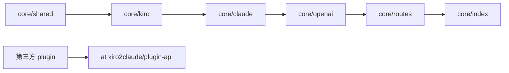

# CLAUDE.md

给在此仓库工作的 Claude Code 看的**规范与地图**。面向使用者的介绍与 HTTP 路由见 [README.md](./README.md),plugin 指南见 [docs/PLUGIN-DEVELOPMENT.md](./docs/PLUGIN-DEVELOPMENT.md);环境变量、wire format 各有单一真相源——本文件只给指针,不复述。

## 项目一句话

把 kiro-cli(Kiro 后端)包装成 **Claude + OpenAI 双协议代理**。Claude 全系 + GPT-5.6(Sol / Terra / Luna);GPT 与 Claude 走**完全相同**的上游、两个协议端点都可用(踩坑 #15)。**MIT**:core 管 HTTP 直发 + plugin 加载;两个内置插件(`metering` 计量、`derived` credit 反演)默认启用,与第三方插件一样只经 [`@kiro2claude/plugin-api`](./packages/plugin-api/) 契约接入。

**运行时**:Node ≥ 22 / TypeScript / ES Modules NodeNext / Fastify / pnpm workspace。

## Monorepo 边界

```
packages/   ★ 全部 MIT
├── plugin-api/           契约包:types + abstract base class,0 runtime deps
├── core/                 gateway runtime:HTTP 路由、plugin loader、token manager
├── plugin-metering/      注入 usage.kiro_metering(credit 计量)
├── plugin-derived/       反演 Kiro credit → Anthropic token,注入 usage.kiro_derived
└── examples/echo-plugin/ 公开示范 plugin

tools/claude-code/        Claude Code CLI 的 Docker harness(人工点验 + headless 回归,非 runtime)
tools/codex/              Codex CLI 的 Docker harness(Responses 端点点验,非 runtime)
docker/Dockerfile         单一发布镜像(core + 两个内置插件)
.github/workflows/        ci.yml:全 workspace lint+typecheck+test;release.yml:见速查表「发版」
```

所有插件都是**普通 npm 包**,loader 唯一发现路径 = 扫 `node_modules/**` 里带 `kiro2claude-plugin` keyword 的包;内置与第三方走**完全相同**的机制(契约不加 tier 字段)。

## 架构地图

```
packages/core/src/
├── index.ts            入口;启动链:config → login → creds → SingleTokenManager
│                       → plugin-host(HookBus + CapabilityRegistry)→ Fastify → 挂路由 → discoverPlugins。
│                       /api/{claude,openai}/v1 = 去泄漏镜像(preHandler 打 stripPluginUsage 标记)
├── token.ts            count_tokens 本地估算 + 远程回退
├── model/config.ts     ★ 环境变量单一真相源(改 env 必先看这里)
├── shared/             横切层(鉴权 / wire-format errors / logger / paths / reqId-ALS),不依赖 kiro claude
├── plugin-host/        ★ 插件契约核心实现
│   ├── hook-bus.ts            按 plugin 注册顺序执行 onUsageFinish
│   ├── usage-finish-event.ts  UsageFinishEventImpl(meta / extensions / overrides)
│   ├── capability-registry.ts host 注册命名 capability,plugin 按 name 取
│   └── loader.ts              node_modules keyword 扫描 + 拓扑排序
├── routes/             HTTP 装配层;唯一可同时 import claude 和 kiro 的地方;prefix 由 index.ts 注入
├── kiro/               上游适配层(token-manager / client-profile / provider / retry-executor / parser);
│                       SingleTokenManager 经 'usage-limits' capability 暴露给 plugin,不直接 export
└── claude/             下游兼容层(HTTP 直发)
    ├── handlers.ts           路由 handler 薄胶水,分发到专职模块
    ├── converter.ts          Claude→Kiro 请求;mapModel / system + thinking + 身份覆写注入
    ├── stream-handler.ts     流式 handler;deferred commit + 空流有界重试(踩坑 #13)
    ├── non-stream-handler.ts 非流式 handler;判空/重试镜像
    ├── non-stream-reduce.ts  reduceKiroResponse:bytes→归约;claude & openai 非流式共用的纯函数
    ├── stream.ts             SSE 状态机;finish 调 hookBus;buildClaudeUsagePayload = Claude usage 唯一组装点
    ├── empty-capture.ts      空流类型 + 诊断抓包(KIRO2CLAUDE_CAPTURE_EMPTY_DIR)
    ├── tool-call-text.ts     泄漏工具调用的检测/救援/剥除;★ 头注释 = 全部红线(踩坑 #14)
    ├── error-mapper.ts       classifyProviderError(状态/文案/Retry-After 真相源)+ mapProviderError
    ├── models-catalog.ts     静态模型列表(含 GPT-5.6)
    └── schemas/ · request-validator.ts · websearch.ts · types.ts · converter/ · stream/

openai/                 OpenAI 兼容层(下游;import claude/kiro/shared,不被反向依赖)。两个协议:
                        Chat Completions + Responses(Codex)。语义核心复用 claude(StreamContext +
                        reduceKiroResponse + provider),仅协议翻译是 OpenAI 特有。
├── stream-transport.ts     chat+responses 共用流式脚手架(复制自 claude,隔离坑 #13)
├── non-stream-transport.ts chat+responses 共用非流式(reduceKiroResponse + 计费 hook)
├── converter.ts            Chat 请求 → MessagesRequest;mapReasoningEffort / parseDataUri 两端共用
├── response-stream.ts      SseEvent → chat.completion.chunk
├── response-nonstream.ts   归约结果 → chat.completion + buildOpenAiUsage(读原始 token,踩坑 #16)
├── stream-handler.ts · non-stream-handler.ts · handlers.ts · error-mapper.ts · models-catalog.ts
└── responses/          OpenAI Responses API(Codex 走这;wire_api=responses)
    ├── converter.ts        Responses 请求(input items / instructions / 扁平 tools)→ MessagesRequest
    ├── response-stream.ts  SseEvent → 严格语义事件序列(踩坑 #17);Claude thinking → reasoning item
    ├── response-nonstream.ts  归约结果 → Response 对象(含 reasoning item)
    └── stream-handler.ts · non-stream-handler.ts · handlers.ts · types.ts
```

**依赖方向**(箭头不得反向):



> `openai/` → `claude/` 是**架构约定**(靠 review),非 biome 强制:`noRestrictedImports` 只约束 plugin-derived / plugin-metering。

## 找东西去哪里(地图速查)

| 想看 | 真相源 |
|---|---|
| `KIRO2CLAUDE_*` 环境变量(core 自用)| `model/schemas/config-schema.ts`(envSchema)+ `.env.example` |
| Plugin 契约类型 | `packages/plugin-api/src/types.ts` |
| 怎么写 plugin | [`docs/PLUGIN-DEVELOPMENT.md`](./docs/PLUGIN-DEVELOPMENT.md) + `packages/examples/echo-plugin/` |
| 支持哪些模型 / 名字映射 | `claude/models-catalog.ts` + `mapModel()`(GPT-5.6 五处同改:mapModel / MODELS_WITH_NATIVE_REASONING / getContextWindowSize / claude+openai catalog)|
| 哪些模型走原生 reasoning | `MODELS_WITH_NATIVE_REASONING` in `converter.ts`(含 GPT-5.6,但其 reasoning 加密不 surface)|
| context window 大小 | `getContextWindowSize()` in `converter.ts`(GPT-5.6 = 272K)|
| effort 阈值映射 | `mapThinkingToEffort()`;OpenAI `reasoning_effort` 见 `openai/converter.ts`(minimal→low,其余透传)|
| OpenAI 端点 / 请求响应翻译 | `packages/core/src/openai/`;路由 `routes/openai.ts`,挂载见 `index.ts` |
| OpenAI Responses / Codex 接入 | `openai/responses/`;harness `tools/codex/`;红线见踩坑 #17 |
| OpenAI 如何复用 Claude 语义 | `openai/` 复用 `StreamContext` + `reduceKiroResponse`;usage **不**经 `buildClaudeUsagePayload`(踩坑 #16)|
| Responses 如何 surface reasoning | Claude thinking → `reasoning` output item(summary 通道);GPT 加密 reasoning 不产;signature 丢弃(踩坑 #17)|
| 身份覆写文案 / 开关 | `IDENTITY_OVERRIDE_DIRECTIVE` in `converter.ts` + `KIRO2CLAUDE_IDENTITY_OVERRIDE`(默认开)|
| 上游 status → 下游 status | `claude/error-mapper.ts` + `shared/upstream-status.ts` |
| kiro-cli 伪装 wire 字段 / 期望版本 | `fixtures/kiro-cli-profile.json` + `kiro/client-profile.ts` FALLBACK_PROFILE |
| `usage` 字段如何被 plugin 注入 | plugin 用 `event.addExtension(...)` / `event.overrideStandardField(...)`;core 不输出特定 plugin 字段 |
| `/api/*` 怎么剥 plugin 扩展 | `index.ts` 的 `/api/*` register 处 + `buildClaudeUsagePayload`(`claude/stream.ts`)|
| 空流重试 / 判空 / 抓包 | 踩坑 #13:`stream-handler.ts` + `stream.ts`(`sawCompletedToolUse`)+ `empty-capture.ts` 头注释 |
| 泄漏工具调用救援红线 | `claude/tool-call-text.ts` 头注释(踩坑 #14)|
| 怎么发版 / 版本号从哪来 | [CONTRIBUTING.md](./CONTRIBUTING.md)「版本与发布」+ `.releaserc.json`(semantic-release 全自动,唯一手动的是 plugin 契约版本)|

## 不可违反的规范

### 架构 / 插件边界

- 依赖方向单向(图见上);所有 plugin(含内置 metering/derived)**必须**经 `@kiro2claude/plugin-api` 集成,**禁止** import core 内部模块(biome `noRestrictedImports` 拦截)
- 新增路由:core 自有放 `packages/core/src/routes/`;plugin 路由用 `ctx.app.register(...)`
- 新增 `KIRO2CLAUDE_*` env:core 自用进 `model/schemas/config-schema.ts`;plugin 用的自己读 `ctx.env`

### Plugin 契约(@kiro2claude/plugin-api)

- 契约类型是 SemVer 公开 API,破坏性改动 = major bump
- 不暴露 kiro-specific 类型(SingleTokenManager / KiroHttpError 等)——用 capability 命名查询
- `addExtension(namespace, value)` 命名空间所有权;`overrideStandardField(name, value, reason)` 显式 override
- Plugin `apiVersion: '1.x'` 必须匹配 host 主版本;`dependsOn` 由 loader 拓扑排序,hook 注册顺序 = 调用顺序

### TypeScript / 模块系统

- pnpm workspace,根 `tsconfig.base.json` 共享 strict + NodeNext + composite
- NodeNext 下相对导入**必须**带 `.js` 扩展(即使源是 `.ts`);永远 `import`,不用 `require()`
- 启动期 I/O 保持同步(`fs.readFileSync` 不改 promise)——让「加载完成」时点确定

### 错误流转

- 上游非 2xx → 抛 `KiroHttpError(status, msg)`(定义在 `kiro/token-manager.ts`)
- `ProviderErrorKind` 是 discriminated union,新增 variant 时 tsc 强制穷尽
- 408/429/503/504 原样透传上游 status(含 Retry-After);500/501/502/505+ 压成 502;401/403 也压 502,避免下游误判「是我的 API key 错」

### 响应文案中性化(防泄漏后端身份)

- 日志可用 `upstream` / `Kiro` 等运维词;响应 body 只说 `service`
- 绝不把 `err.message` 或上游 body 拼进下游响应;只放进 `log.warn` 字段
- 新增 mapper case **必须**加 leak-detection 断言

### 原生 reasoning 路径互斥

- 走原生 reasoning 时**同时禁用**:请求侧 `<thinking_mode>` prompt 前缀注入、响应侧 `<thinking>` 标签扫描

### 代码风格

| 场景 | 做法 |
|---|---|
| 错误 | `throw` + `try/catch` + 自定义 `Error` 子类 |
| 可空值 | `T \| undefined` 而非 `null`;用 `??` / `?.` |
| 多形态 | discriminated union |
| 异步互斥 | 手写 `AsyncMutex`(Promise-based) |
| 时间戳 | `Date.now()` 毫秒 |
| 键值集合 | `Map<K, V>` 优先于裸对象 |
| 二进制 | `Buffer` + 自维护 offset;默认大端序 |
| JSON 字段 | camelCase(Kiro API 本就 camelCase) |
| 配置加载 | 启动期同步读 `process.env` |

## 高频踩坑陷阱

1. **Fastify logger**:用 `loggerInstance: pinoInstance`,不是 `logger:`
2. **Parser Result 类型守卫**:用 `'frame' in result`,**不是** `result.ok`
3. **CRC32 符号位**:`crc-32` 返回有符号 32-bit,必须 `>>> 0`
4. **AWS Event Stream 全 big-endian**:`readUInt32BE` / `readInt16BE` / `readBigInt64BE`
5. **AsyncMutex 必要性**:JS 单线程,但 `await` 会让出控制权
6. **AWS SSO OIDC wire**:Smithy 协议,请求/响应**都**是 camelCase
7. **API key 比较**:必须 `crypto.timingSafeEqual`
8. **SQLite 凭据不可跨机器**:refresh 可能返回新 refreshToken 写回 SQLite
9. **better-sqlite3 跨架构**:Mac → Linux 容器构建必须在 builder 阶段编译
10. **SIGTERM**:Docker 用 `tini` 作 PID 1,`forceCloseConnections: 'idle'` 是优雅关闭关键
11. **core 不发 cachePoint**:`cache_control` / `cachePoint` 在 Kiro 被静默忽略,`convertTools` 只输出 `{toolSpecification}`;缓存红利由上游按相同 prefix / session 自动给,不靠请求侧 marker
12. **convertTools 剥 tool-search marker**:client 的 tool-search 合成 marker 工具(无 `input_schema`)上送会 400;`isToolSearchTool()` 丢 marker、忽略 `defer_loading`,真实工具全量转发
13. **空流有界重试**:上游偶发回「200 OK + 零内容帧」,客户端无法与真实过载区分,retry-executor 又看不到 2xx 的 event-stream body。**pre-commit**(未向客户端写任何字节)时对同一请求重发最多 `KIRO2CLAUDE_EMPTY_STREAM_RETRIES`(默认 2)次,已 commit 绝不重试。红线在 `stream-handler.ts`(重试循环)+ `stream.ts`(`sawCompletedToolUse` 判空两路对齐)+ `empty-capture.ts` 头注释;确定性空流用 `KIRO2CLAUDE_CAPTURE_EMPTY_DIR` 抓包定位,**别凭假设盲改 converter**
14. **工具调用文本泄漏(会历史自污染)**:上游解析偶发失败,工具调用块以纯文本掉进响应,留在会话历史会被模型模仿 → 同会话确定性复发。`KIRO2CLAUDE_TOOL_CALL_TEXT_RESCUE`(默认开)双向兜底:响应侧解析回真 tool_use、请求侧剥历史泄漏块让会话自愈。全部红线在 `claude/tool-call-text.ts` 头注释,**改前必读**;勿再引入「大文件分块写入」类 prompt 指令(已实测证伪、连同 `SYSTEM_CHUNKED_POLICY` 移除)
15. **GPT-5.6 与 Claude 走完全相同的上游**:请求体逐字段相同,唯一差异是 `modelId`——支持 GPT = `mapModel` 加分支即两端可用,**无需**新上游适配。响应侧唯一真差异:GPT reasoning 走**同名** `reasoningContentEvent`,payload 是 `{redactedContent}`(加密、无 text/signature),`stream.ts` `processReasoningContent` 顶部 `if(!text&&!signature)return[]` 整块丢弃(否则开空 thinking 块);`metadataEvent{stopReason}` 故意落 `Unknown`、由网关自行推断(工具调用时 `tool_use` 比上游 `END_TURN` 准),**保持现状**
16. **OpenAI `prompt_tokens` ≠ Claude `input_tokens`**:`buildClaudeUsagePayload` 会应用 derived 插件的 `input_tokens` 覆写(缓存拆分语义),而 OpenAI `prompt_tokens` 是**输入总量(含缓存)**。故 `openai/` usage **必须**直接读 reducer 原始 `contextInputTokens ?? inputTokens` 与 `outputTokens`、**绕过** `buildClaudeUsagePayload`;计费 hook 仍照跑,首版只出标准三字段、不含 `kiro_*` 扩展
17. **Codex 只说 Responses + 只对识别的模型名发工具**:① `wire_api=chat` 在 Codex 0.122+ 被移除,Codex 必须走 `/openai/v1/responses`(Responses 与 Chat 是两套东西:请求 `input` items + 扁平 tools,响应是严格语义事件序列)。② Codex 只对内部识别的模型名下发工具,故 `mapModel` 把 `gpt-*-codex` **别名**到 `gpt-5.6-sol`,Codex config 用 `gpt-5-codex` 才有工具调用。编码器红线全在 `openai/responses/response-stream.ts` 头注释(`content_part.added` 必须先于 `output_text.delta`、done 回填全文、纯工具调用不产空 message、Claude thinking → reasoning summary item 惰性开),**改编码器前先跑一遍真实 Codex**(harness `tools/codex/`)

## 测试

- vitest;每个 workspace 包自带 `vitest.config.ts`
- pre-commit 强制 `biome check + pnpm -r typecheck + pnpm -r test`;核心模块改动必须全 workspace 双通过
- **e2e 不进 CI**:`packages/core/test/e2e/*.test.ts` 消耗真实 token
- **默认测试模型统一 `claude-opus-4-6`**:它走原生 reasoning 路径、行为与其它模型不同,统一基准让复现与真实使用一致(curl 设 `model`,Docker 跑 Claude Code 设 `ANTHROPIC_MODEL`)
- 固定测试图在 `packages/core/test/fixtures/images/`:`test-small.png` 内联为 image 块;`test-large.png`(~640KB)超内联阈值 → 触发 Read 工具路径,经 tool_result 回传,converter 须提升到 message-level `images`
