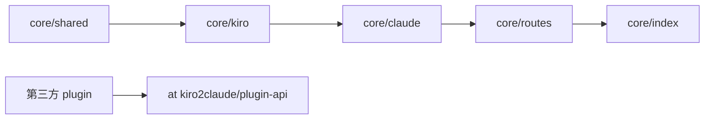

# CLAUDE.md

给在此仓库工作的 Claude Code 看的**规范与地图**。**面向使用者**的项目介绍、HTTP 路由见 [README.md](./README.md);plugin 开发指南见 [docs/PLUGIN-DEVELOPMENT.md](./docs/PLUGIN-DEVELOPMENT.md);详细的环境变量与 wire format 都在各自的单一真相源里——本文件只给指针,不复述。

## 项目一句话

把 kiro-cli(AWS CodeWhisperer / Kiro 后端)包装成 Claude API 兼容代理。**Open-core 形态**:开源 core 处理 HTTP 直发 + plugin 加载;first-party enterprise plugins 在独立私有仓,通过 [`@kiro2claude/plugin-api`](./packages/plugin-api/) 接入,**本仓不维护其源码**。

**运行时**:Node.js ≥ 22 / TypeScript 5.9 / ES Modules NodeNext / Fastify 5 / pnpm workspace。

## Monorepo 边界

```
packages/   ★ MIT 边界 —— 公开 mirror 同步这里
├── plugin-api/        契约包:types + abstract base class,0 runtime deps
├── core/              gateway runtime:HTTP /claude/v1/*,plugin loader,token manager
│                      依赖 plugin-metering(随镜像携带,默认启用)
├── plugin-metering/   free runtime plugin:注入 usage.kiro_metering(credit 计量)
└── examples/
    └── echo-plugin/   公开示范 plugin

docker/
└── Dockerfile         公开镜像(mirror 包含)

.github/workflows/   ★ 不入 mirror(deploy key 无权推 workflow 文件 → 公开仓无 CI)
├── ci.yml             全测试(仅 enterprise 仓内运行)
└── release-core.yml   core 镜像发 Docker Hub(不发 npm)
```

Plugin 分两档:**free** plugin(如 `packages/plugin-metering`)随 core 镜像分发、默认启用,作为 core 依赖经 `node_modules` keyword 被发现;**enterprise** plugins 通过 `@kiro2claude/plugin-api` 接入,源码在独立私有仓。loader 同时扫描 `node_modules/**`(任何带 `kiro2claude-plugin` keyword 的包)和 `enterprise/plugin-*/dist/`(workspace-local 约定,允许私有仓 clone 到这里联调)。free vs enterprise 的区分**只看镜像里物理打包了哪些插件**,不在契约里加 tier 字段。

## 架构地图

```
packages/core/src/
├── index.ts            入口;按顺序:loadConfigFromEnv → bootstrap-login → load creds
│                       → SingleTokenManager → auto-capture → cli-version 校验
│                       → init plugin-host (HookBus + CapabilityRegistry)
│                       → 装配 Fastify → 挂 health/claude/kiro 路由
│                       → discoverPlugins() 自动加载 node_modules + workspace-local
├── token.ts            count_tokens 本地估算 + 远程回退
├── model/config.ts     ★ 环境变量单一真相源(修改 env 必先看这里)
├── shared/             横切层(鉴权 / wire-format errors / logger / paths
│                       / reqId-ALS)。**不依赖** kiro/ claude/
├── plugin-host/        ★ 插件契约的核心实现
│   ├── hook-bus.ts            HookBus,按 plugin 注册顺序顺序执行 onUsageFinish
│   ├── usage-finish-event.ts  UsageFinishEventImpl(meta/extensions/overrides)
│   ├── capability-registry.ts host 注册命名 capability,plugin 通过 name 取
│   └── loader.ts              双源扫描(workspace + node_modules)+ 拓扑排序
├── routes/             HTTP 装配层;唯一允许同时 import claude/ 和 kiro/ 的地方
│                       prefix 由 index.ts 注入,**不**在 routes 文件里写 prefix
├── kiro/               上游适配层(token-manager / client-profile / provider /
│                       retry-executor / parser)。**SingleTokenManager 通过
│                       'usage-limits' capability 暴露给 plugin**,不直接 export
└── claude/             下游兼容层(HTTP 直发路径)
    ├── converter.ts         Claude→Kiro 请求;mapModel / system + thinking + 身份覆写注入
    ├── error-mapper.ts      ProviderError → Fastify reply(错误翻译唯一真相源)
    ├── stream.ts            SSE 状态机;finish 时调 hookBus.runUsageFinish()
    ├── non-stream-handler.ts 同上,非流式版
    ├── models-catalog.ts    静态模型列表
    └── schemas/             zod 校验
```

**依赖方向**(箭头不得反向;ESLint `biome.json` 的 `noRestrictedImports` 强制这条边界):



第三方 plugin 只依赖 `@kiro2claude/plugin-api`,**禁止** import `@kiro2claude/core` 内部模块。

## 找东西去哪里(地图速查)

| 想看 | 真相源 |
|---|---|
| 所有 `KIRO2CLAUDE_*` 环境变量(core 自用)| `packages/core/src/model/schemas/config-schema.ts`(envSchema) + `.env.example` |
| Plugin 契约类型定义 | `packages/plugin-api/src/types.ts`(contract 真相源) |
| 怎么写 plugin | [`docs/PLUGIN-DEVELOPMENT.md`](./docs/PLUGIN-DEVELOPMENT.md) + `packages/examples/echo-plugin/` |
| 支持哪些模型 / 模型名映射 | `packages/core/src/claude/models-catalog.ts` + `mapModel()` in `converter.ts` |
| 哪些模型走原生 reasoning | `MODELS_WITH_NATIVE_REASONING` in `converter.ts` |
| effort 阈值映射 | `mapThinkingToEffort()` in `converter.ts` |
| 身份覆写文案 / 开关 | `IDENTITY_OVERRIDE_DIRECTIVE` in `converter.ts` + `KIRO2CLAUDE_IDENTITY_OVERRIDE` env(默认开,挡模型自报 Q/Kiro) |
| 上游 status → 下游 status | `packages/core/src/claude/error-mapper.ts` + `shared/upstream-status.ts` |
| kiro-cli 伪装 wire 字段 | `fixtures/kiro-cli-profile.json` + `kiro/client-profile.ts` FALLBACK_PROFILE |
| 期望的 kiro-cli 版本 | `fixtures/kiro-cli-profile.json.kiroCliVersion` |
| `usage` wire 字段如何被 plugin 注入 | core 不输出特定 plugin 字段;plugin 通过 `event.addExtension(...)` / `event.overrideStandardField(...)` 注入 |

## 不可违反的规范

### 架构 / open-core 边界

- 依赖方向单向(图见[架构地图](#架构地图));第三方 plugin **必须**通过 `@kiro2claude/plugin-api` 集成,**禁止** import core 内部模块(ESLint 拦截)
- 新增 HTTP 路由:core 自有路由在 `packages/core/src/routes/`;plugin 路由通过 `ctx.app.register(...)` 注册
- 新增 `KIRO2CLAUDE_*` env:core 自用的在 `model/schemas/config-schema.ts`;plugin 用的由 plugin 自己读 `ctx.env`,不在 core schema 校验

### Plugin 契约(@kiro2claude/plugin-api)

- 契约类型是 SemVer 公开 API,破坏性改动 = major bump
- 不暴露 kiro-specific 类型(SingleTokenManager / KiroHttpError / 等)—— 用 capability 命名查询
- `addExtension(namespace, value)` 命名空间所有权;`overrideStandardField(name, value, reason)` 显式 override
- Plugin 的 `apiVersion: '1.x'` 必须匹配 host 的主版本,loader 拒绝不兼容
- 加载顺序:声明 `dependsOn` 让 loader 拓扑排序;hook 注册顺序 = 调用顺序

### TypeScript / 模块系统

- workspace 用 pnpm,根 `tsconfig.base.json` 共享 strict + NodeNext + composite 配置
- `tsconfig.json` 是 NodeNext,所有相对导入**必须**带 `.js` 扩展(即使源是 `.ts`)
- 永远 `import`,不用 `require()`
- 启动期 I/O 保持同步(`fs.readFileSync` 不要改成 promise)——目的是让"加载完成"时点确定

### 错误流转

- 上游非 2xx → 抛 `KiroHttpError(status, msg)`(定义在 `kiro/token-manager.ts`)
- `error-mapper.ts` 的 `ProviderErrorKind` 是 discriminated union;新增 variant 时 tsc 会强制穷尽
- 408/429/503/504 故意原样透传上游 status(含 Retry-After);500/501/502/505+ 压成 502
- 401/403 维持 502,避免下游误判"是我的 API key 错"

### 响应文案中性化(防泄漏后端身份)

- 日志用 `upstream` / `Kiro` 等运维词汇;响应 body 只说 `service`
- 绝不把 `err.message` 或上游 response body 直接拼进下游响应;只放进 `log.warn` 字段
- 新增 mapper case **必须**加 leak-detection 断言

### 原生 reasoning 路径互斥

- 走原生 reasoning 时**同时禁用**:请求侧 `<thinking_mode>` prompt 前缀注入、响应侧 `<thinking>` 标签扫描

### 代码风格

| 场景 | 做法 |
|---|---|
| 错误 | `throw` + `try/catch` + 自定义 `Error` 子类区分类型 |
| 可空值 | `T \| undefined` 而非 `null`;用 `??` / `?.` |
| 多形态 | discriminated union |
| 异步互斥 | 手写 `AsyncMutex`(Promise-based) |
| 时间戳 | `Date.now()` 毫秒数 |
| 键值集合 | `Map<K, V>` 优先于裸对象 |
| 二进制 | `Buffer` + 自维护 offset;默认大端序 |
| JSON 字段 | camelCase(Kiro API 本来就是 camelCase) |
| 配置加载 | 启动期同步读 `process.env` |

## 高频踩坑陷阱

1. **Fastify 5 logger**:用 `loggerInstance: pinoInstance`,不是 `logger: pinoInstance`
2. **Parser Result 类型守卫**:用 `'frame' in result`,**不是** `result.ok`
3. **CRC32 符号位**:`crc-32` 返回有符号 32-bit,必须 `>>> 0`
4. **AWS Event Stream 全部 big-endian**:`readUInt32BE` / `readInt16BE` / `readBigInt64BE`
5. **AsyncMutex 必要性**:JS 单线程但 `await` 让出控制权
6. **AWS SSO OIDC wire format**:Smithy 协议,请求/响应**都**是 camelCase
7. **API key 比较**:必须 `crypto.timingSafeEqual`
8. **SQLite 凭据不可跨机器共享**:refresh 可能返回新 refreshToken 写回 SQLite
9. **better-sqlite3 跨架构**:Mac → Linux 容器构建必须在 builder 阶段编译
10. **SIGTERM**:Docker 镜像用 `tini` 作为 PID 1,`forceCloseConnections: 'idle'` 是优雅关闭关键
11. **Plugin 同名冲突**:workspace-local + node_modules 同名 plugin 默认报错;用 `KIRO2CLAUDE_PLUGINS_LOCAL=foo` 显式选 local
12. **Mirror sync-mirror 白名单**:加任何 root 文件都要想清楚——白名单不包含 = 不会出现在公开 mirror;且 `.github/workflows/*` **绝不能**加进白名单——mirror 经 SSH deploy key 推送,而 deploy key 无权创建/更新 workflow 文件(需 `workflow` scope),加了会让 push 被服务端拒(`refusing to allow ... without workflow scope`)
13. **core 不发 cachePoint**:Anthropic `cache_control` / Bedrock `cachePoint` 在 Kiro 上被静默忽略(实测带不带逐位相同),`convertTools` 只输出 `{toolSpecification}`。缓存红利由上游按相同 prefix / session 历史自动给,不靠请求侧 marker。
14. **convertTools 剥离 tool-search marker**:client 开 tool-search beta 发的无 `input_schema` 合成 marker 工具上送 Kiro 会 400。`isToolSearchTool()` 丢 marker、忽略 `defer_loading` 全量转发真实工具。
15. **空流有界重试是「零重试转发」的有意例外**:上游偶发回「200 OK + 零内容帧」空流(下游 SDK 显示成 529 overloaded)。handler 层在 **pre-commit**(未向客户端写任何字节)时对同一请求重发最多 `KIRO2CLAUDE_EMPTY_STREAM_RETRIES`(默认 2)次吸收瞬时空流——**已 commit 的尝试绝不重试**(HTTP 头已发,无法回滚)。这是少数偏离 retry-executor「零退避转发」哲学的地方,因为空 200 流是客户端无法与真实过载区分的退化失败。判空 = `!hasContent()`(流式)/ 无 text+toolUses+reasoning 且 stopReason 非 `max_tokens`/`model_context_window_exceeded`(非流式)。重试只在 handler 层(retry-executor 对 2xx 直接 return、看不到 event-stream body)。**确定性空流**(每次重试都空)的根因依赖真实请求内容、无法合成复现——用 `KIRO2CLAUDE_CAPTURE_EMPTY_DIR` 抓真实请求体再证据驱动定位,**不要**凭假设盲改 converter。

## 测试

- 框架 vitest,每个 workspace 包自己有 `vitest.config.ts`
- pre-commit 强制 `biome check + pnpm -r typecheck + pnpm -r test`
- 核心模块改动必须全 workspace `pnpm -r typecheck && test` 双通过
- **e2e 不进 CI**:`packages/core/test/e2e/*.test.ts` 消耗真实 token
- **默认测试模型统一用 `claude-opus-4-6`**:凡是需要指定模型的测试 / e2e / 手动复现都以 opus 4.6 为基准——它走原生 reasoning 路径,行为与其它 model 不同,统一基准让复现与真实使用一致(curl 设 `"model"`,Docker 跑 Claude Code 设 `ANTHROPIC_MODEL`)
- 固定测试图在 `packages/core/test/fixtures/images/`:`test-small.png`(小图,Claude Code 内联为 image 块走 message-level `images`)、`test-large.png`(大图 ~640KB,稳超内联阈值 → 触发 Claude Code 的 Read 工具路径,图片经 tool_result 回传,converter 须提升到 message-level `images`)
