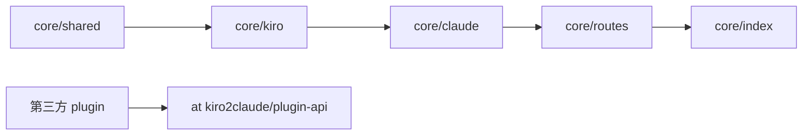

# CLAUDE.md

给在此仓库工作的 Claude Code 看的**规范与地图**。面向使用者的项目介绍与 HTTP 路由见 [README.md](./README.md),plugin 开发指南见 [docs/PLUGIN-DEVELOPMENT.md](./docs/PLUGIN-DEVELOPMENT.md),环境变量与 wire format 在各自的单一真相源里——本文件只给指针,不复述。

## 项目一句话

把 kiro-cli(AWS CodeWhisperer / Kiro 后端)包装成 Claude API 兼容代理。**MIT 开源**:core 处理 HTTP 直发 + plugin 加载;两个 first-party 插件(`metering` 计量、`derived` credit 反演)随镜像携带、默认启用,与第三方插件一样只通过 [`@kiro2claude/plugin-api`](./packages/plugin-api/) 契约接入。

**运行时**:Node.js ≥ 22 / TypeScript 5.9 / ES Modules NodeNext / Fastify 5 / pnpm workspace。

## Monorepo 边界

```
packages/   ★ 全部 MIT
├── plugin-api/           契约包:types + abstract base class,0 runtime deps
├── core/                 gateway runtime:HTTP /claude/v1/*、plugin loader、token manager;
│                         依赖下面两个 first-party 插件(随镜像携带,默认启用)
├── plugin-metering/      注入 usage.kiro_metering(credit 计量)
├── plugin-derived/       反演 Kiro credit → Anthropic token,注入 usage.kiro_derived
└── examples/echo-plugin/ 公开示范 plugin

tools/claude-code/        Claude Code CLI 的 Docker harness(人工点验 + headless 兼容回归,非 runtime)
docker/Dockerfile         单一发布镜像(core + 两个内置插件)
.github/workflows/        ci.yml:全 workspace lint + typecheck + test;release.yml:见速查表「发版」行
```

所有插件都是**普通 npm 包**,loader 唯一的发现路径 = 扫 `node_modules/**` 里带 `kiro2claude-plugin` keyword 的包;first-party 与第三方走**完全相同**的机制(契约里不加 tier 字段)。

## 架构地图

```
packages/core/src/
├── index.ts            入口;按顺序:loadConfigFromEnv → bootstrap-login → load creds
│                       → SingleTokenManager → auto-capture → cli-version 校验
│                       → init plugin-host(HookBus + CapabilityRegistry)→ 装配 Fastify
│                       → 挂 health/claude/api/kiro 路由 → discoverPlugins() 加载插件
│                       (/api/v1 = /claude/v1 的去泄漏镜像,作用域 preHandler 打
│                        stripPluginUsage 标记)
├── token.ts            count_tokens 本地估算 + 远程回退
├── model/config.ts     ★ 环境变量单一真相源(改 env 必先看这里)
├── shared/             横切层(鉴权 / wire-format errors / logger / paths / reqId-ALS);
│                       不依赖 kiro/ claude/
├── plugin-host/        ★ 插件契约的核心实现
│   ├── hook-bus.ts            按 plugin 注册顺序执行 onUsageFinish
│   ├── usage-finish-event.ts  UsageFinishEventImpl(meta/extensions/overrides)
│   ├── capability-registry.ts host 注册命名 capability,plugin 按 name 取
│   └── loader.ts              node_modules keyword 扫描 + 拓扑排序
├── routes/             HTTP 装配层;唯一允许同时 import claude/ 和 kiro/ 的地方;
│                       prefix 由 index.ts 注入,不在 routes 文件里写
├── kiro/               上游适配层(token-manager / client-profile / provider /
│                       retry-executor / parser);SingleTokenManager 经 'usage-limits'
│                       capability 暴露给 plugin,不直接 export
└── claude/             下游兼容层(HTTP 直发路径)
    ├── handlers.ts           路由 handler 薄胶水,分发到各专职模块
    ├── converter.ts          Claude→Kiro 请求;mapModel / system + thinking + 身份覆写注入
    ├── stream-handler.ts     流式 handler;deferred commit + pre-commit 空流有界重试
    ├── non-stream-handler.ts 非流式 handler;同一套判空/重试的镜像
    ├── stream.ts             SSE 状态机;finish 时调 hookBus.runUsageFinish();
    │                         buildClaudeUsagePayload = usage 唯一组装点(流式+非流式共用)
    ├── empty-capture.ts      空流共享类型 + 诊断抓包(KIRO2CLAUDE_CAPTURE_EMPTY_DIR)
    ├── tool-call-text.ts     泄漏工具调用的检测/救援/剥除;★ 头注释 = 该问题全部红线
    ├── error-mapper.ts       ProviderError → Fastify reply(错误翻译唯一真相源)
    ├── models-catalog.ts     静态模型列表
    ├── schemas/              zod 校验
    └── request-validator.ts / websearch.ts / types.ts / converter/ / stream/
```

**依赖方向**(箭头不得反向;`biome.json` 的 `noRestrictedImports` 强制):



## 找东西去哪里(地图速查)

| 想看 | 真相源 |
|---|---|
| 所有 `KIRO2CLAUDE_*` 环境变量(core 自用)| `packages/core/src/model/schemas/config-schema.ts`(envSchema)+ `.env.example` |
| Plugin 契约类型定义 | `packages/plugin-api/src/types.ts` |
| 怎么写 plugin | [`docs/PLUGIN-DEVELOPMENT.md`](./docs/PLUGIN-DEVELOPMENT.md) + `packages/examples/echo-plugin/` |
| 支持哪些模型 / 模型名映射 | `packages/core/src/claude/models-catalog.ts` + `mapModel()` in `converter.ts` |
| 哪些模型走原生 reasoning | `MODELS_WITH_NATIVE_REASONING` in `converter.ts` |
| effort 阈值映射 | `mapThinkingToEffort()` in `converter.ts` |
| 身份覆写文案 / 开关 | `IDENTITY_OVERRIDE_DIRECTIVE` in `converter.ts` + `KIRO2CLAUDE_IDENTITY_OVERRIDE` env(默认开,挡模型自报 Q/Kiro) |
| 上游 status → 下游 status | `packages/core/src/claude/error-mapper.ts` + `shared/upstream-status.ts` |
| kiro-cli 伪装 wire 字段 / 期望版本 | `fixtures/kiro-cli-profile.json`(`.kiroCliVersion`)+ `kiro/client-profile.ts` FALLBACK_PROFILE |
| `usage` 字段如何被 plugin 注入 | core 不输出特定 plugin 字段;plugin 用 `event.addExtension(...)` / `event.overrideStandardField(...)` |
| `/api/v1` 怎么剥掉 plugin 扩展 | `index.ts` 的 `/api/v1` register 处注释 + `buildClaudeUsagePayload`(`claude/stream.ts`) |
| 空流重试 / 判空 / 抓包 | 踩坑 #13 的指针:`stream-handler.ts` 头注释 + `stream.ts` `sawCompletedToolUse` 注释 + `empty-capture.ts` |
| 泄漏工具调用救援的红线 | `claude/tool-call-text.ts` 模块头注释(踩坑 #14) |
| 怎么发版 / 版本号从哪来 | [CONTRIBUTING.md](./CONTRIBUTING.md)「版本与发布」+ `.releaserc.json`;全自动 semantic-release,唯一手动的是 plugin 包版本(契约版本,不被自动 bump) |

## 不可违反的规范

### 架构 / 插件边界

- 依赖方向单向(图见上);所有 plugin(含内置的 metering/derived)**必须**通过 `@kiro2claude/plugin-api` 集成,**禁止** import core 内部模块(biome `noRestrictedImports` 拦截,已覆盖 plugin-derived / plugin-metering)
- 新增 HTTP 路由:core 自有的放 `packages/core/src/routes/`;plugin 路由用 `ctx.app.register(...)`
- 新增 `KIRO2CLAUDE_*` env:core 自用的进 `model/schemas/config-schema.ts`;plugin 用的自己读 `ctx.env`,不进 core schema

### Plugin 契约(@kiro2claude/plugin-api)

- 契约类型是 SemVer 公开 API,破坏性改动 = major bump
- 不暴露 kiro-specific 类型(SingleTokenManager / KiroHttpError 等)——用 capability 命名查询
- `addExtension(namespace, value)` 命名空间所有权;`overrideStandardField(name, value, reason)` 显式 override
- Plugin 的 `apiVersion: '1.x'` 必须匹配 host 主版本,loader 拒绝不兼容
- 加载顺序:声明 `dependsOn` 由 loader 拓扑排序;hook 注册顺序 = 调用顺序

### TypeScript / 模块系统

- pnpm workspace,根 `tsconfig.base.json` 共享 strict + NodeNext + composite 配置
- NodeNext 下所有相对导入**必须**带 `.js` 扩展(即使源是 `.ts`);永远 `import`,不用 `require()`
- 启动期 I/O 保持同步(`fs.readFileSync` 不要改成 promise)——让「加载完成」时点确定

### 错误流转

- 上游非 2xx → 抛 `KiroHttpError(status, msg)`(定义在 `kiro/token-manager.ts`)
- `ProviderErrorKind` 是 discriminated union,新增 variant 时 tsc 强制穷尽
- 408/429/503/504 故意原样透传上游 status(含 Retry-After);500/501/502/505+ 压成 502;401/403 也维持 502,避免下游误判「是我的 API key 错」

### 响应文案中性化(防泄漏后端身份)

- 日志可用 `upstream` / `Kiro` 等运维词汇;响应 body 只说 `service`
- 绝不把 `err.message` 或上游 response body 拼进下游响应;只放进 `log.warn` 字段
- 新增 mapper case **必须**加 leak-detection 断言

### 原生 reasoning 路径互斥

- 走原生 reasoning 时**同时禁用**:请求侧 `<thinking_mode>` prompt 前缀注入、响应侧 `<thinking>` 标签扫描

### 代码风格

| 场景 | 做法 |
|---|---|
| 错误 | `throw` + `try/catch` + 自定义 `Error` 子类区分类型 |
| 可空值 | `T \| undefined` 而非 `null`;用 `??` / `?.` |
| 多形态 | discriminated union |
| 异步互斥 | 手写 `AsyncMutex`(Promise-based) |
| 时间戳 | `Date.now()` 毫秒数 |
| 键值集合 | `Map<K, V>` 优先于裸对象 |
| 二进制 | `Buffer` + 自维护 offset;默认大端序 |
| JSON 字段 | camelCase(Kiro API 本来就是 camelCase) |
| 配置加载 | 启动期同步读 `process.env` |

## 高频踩坑陷阱

1. **Fastify 5 logger**:用 `loggerInstance: pinoInstance`,不是 `logger: pinoInstance`
2. **Parser Result 类型守卫**:用 `'frame' in result`,**不是** `result.ok`
3. **CRC32 符号位**:`crc-32` 返回有符号 32-bit,必须 `>>> 0`
4. **AWS Event Stream 全部 big-endian**:`readUInt32BE` / `readInt16BE` / `readBigInt64BE`
5. **AsyncMutex 必要性**:JS 单线程但 `await` 让出控制权
6. **AWS SSO OIDC wire format**:Smithy 协议,请求/响应**都**是 camelCase
7. **API key 比较**:必须 `crypto.timingSafeEqual`
8. **SQLite 凭据不可跨机器共享**:refresh 可能返回新 refreshToken 写回 SQLite
9. **better-sqlite3 跨架构**:Mac → Linux 容器构建必须在 builder 阶段编译
10. **SIGTERM**:Docker 镜像用 `tini` 作为 PID 1,`forceCloseConnections: 'idle'` 是优雅关闭关键
11. **core 不发 cachePoint**:Anthropic `cache_control` / Bedrock `cachePoint` 在 Kiro 上被静默忽略(实测带不带逐位相同),`convertTools` 只输出 `{toolSpecification}`;缓存红利由上游按相同 prefix / session 历史自动给,不靠请求侧 marker
12. **convertTools 剥离 tool-search marker**:client 开 tool-search beta 发的无 `input_schema` 合成 marker 工具上送 Kiro 会 400;`isToolSearchTool()` 丢 marker、忽略 `defer_loading`,真实工具全量转发
13. **空流有界重试是「零重试转发」的有意例外**:上游偶发回「200 OK + 零内容帧」空流,客户端无法与真实过载区分,而 retry-executor 对 2xx 直接 return、看不到 event-stream body,所以由 handler 层吸收:**pre-commit**(未向客户端写任何字节)时对同一请求重发最多 `KIRO2CLAUDE_EMPTY_STREAM_RETRIES`(默认 2)次,已 commit 的尝试绝不重试。机制与红线全在真相源头注释:deferred commit + 重试循环见 `stream-handler.ts`,判空**两路对齐**红线(流式漏判 = 同一请求 stream 503 / non-stream 200)见 `stream.ts` 的 `sawCompletedToolUse` 字段注释,重试耗尽文案语义见 `EMPTY_UPSTREAM_DETERMINISTIC_MESSAGE` 注释。遇到**每次重试都空**的确定性空流:用 `KIRO2CLAUDE_CAPTURE_EMPTY_DIR`(`empty-capture.ts`)抓真实请求体、证据驱动定位,**不要**凭假设盲改 converter。
14. **工具调用会以文本形态泄漏(且历史自我污染)**:上游解析偶发失败时,工具调用标记块以纯文本掉进响应;泄漏文本留在会话历史会被模型模仿 → 同一会话确定性复发。`KIRO2CLAUDE_TOOL_CALL_TEXT_RESCUE`(默认开)双向兜底:响应侧把泄漏块解析回真 tool_use、请求侧剥掉历史泄漏块让会话自愈——这是本失败形态**唯一的防线**。设计与全部红线(四重门误报防护、悬空块永不丢弃、CommonMark 围栏细则、解析预算熔断、`antml:` 前缀动态拼接)都在 `claude/tool-call-text.ts` 模块头注释,**改前必读**。防回归教训(代码已删、无真相源,只记录在此):**勿再引入**「大文件分块写入」类 prompt 指令——已经多模型大规模实测证伪:对泄漏零收益,反而使任务往返轮次显著暴增,已连同 `SYSTEM_CHUNKED_POLICY` 一并移除。

## 测试

- vitest;每个 workspace 包自己有 `vitest.config.ts`
- pre-commit 强制 `biome check + pnpm -r typecheck + pnpm -r test`;核心模块改动必须全 workspace 双通过
- **e2e 不进 CI**:`packages/core/test/e2e/*.test.ts` 消耗真实 token
- **默认测试模型统一 `claude-opus-4-6`**:它走原生 reasoning 路径、行为与其它模型不同,统一基准让复现与真实使用一致(curl 设 `"model"`,Docker 跑 Claude Code 设 `ANTHROPIC_MODEL`)
- 固定测试图在 `packages/core/test/fixtures/images/`:`test-small.png` 小图,Claude Code 内联为 image 块;`test-large.png`(~640KB)稳超内联阈值 → 触发 Read 工具路径,图片经 tool_result 回传,converter 须提升到 message-level `images`
