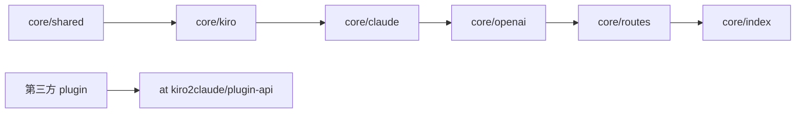

# CLAUDE.md

给在此仓库工作的 Claude Code 看的**规范与地图**。面向使用者的介绍与 HTTP 路由见 [README.md](./README.md),plugin 指南见 [docs/PLUGIN-DEVELOPMENT.md](./docs/PLUGIN-DEVELOPMENT.md);环境变量、wire format 各有单一真相源——本文件只给指针,不复述。

## 项目一句话

把 kiro-cli(Kiro 后端)包装成 **Claude + OpenAI 双协议代理**。Claude 全系 + GPT-5.6(Sol / Terra / Luna);GPT 与 Claude 走**完全相同**的上游、两个协议端点都可用(踩坑「GPT 完全相同上游」)。**MIT**:core 管 HTTP 直发 + plugin 加载;两个内置插件(`metering` 计量、`derived` credit 反演)默认启用,与第三方插件一样只经 [`@kiro2claude/plugin-api`](./packages/plugin-api/) 契约接入。

**运行时**:Node ≥ 22 / TypeScript / ES Modules NodeNext / Fastify / pnpm workspace。

## Monorepo 边界

```
packages/   ★ 全部 MIT
├── plugin-api/           契约包:types + abstract base class,0 runtime deps
├── core/                 gateway runtime:HTTP 路由、plugin loader、token manager
├── plugin-metering/      注入 usage.kiro_metering(credit 计量)
├── plugin-derived/       反演 Kiro credit → Anthropic token,注入 usage.kiro_derived
└── examples/echo-plugin/ 公开示范 plugin

packages/core/test/manual/ 手工工具(非 CI,vitest 不收;打真实上游会计费)
                          `kiro-cli-probe.ts`          反向驱动真实 kiro-cli:伪造 event-stream 让它
                                                       真的执行某个工具、注入错误码看重试策略、或用
                                                       `PROBE_STREAM_SHAPE=text-eof` 看它对无尾帧 EOF 的处理
                          `_harness.mjs`               下面所有脚本共用:env / 发请求 / 解 SSE / 号段校验 /
                                                       **两套协议不变量** / 汇总退出码。新脚本从这里
                                                       拿,别再各写一份缩水的不变量集
                          `protocol-integrity.mjs`     双协议流式完整性:确定性序列 + 协议不变量
                          `backpressure-integrity.mjs` 慢客户端背压下终结段/内容是否完整
                          `concurrency-integrity.mjs`  并发下的区间隔离(串扰检测)
                          `gpt-tool-matrix.mjs`        GPT 真实工具往返矩阵:effort × 协议 × 流/非流
                                                       (可选图片用例);不重试,失败原样留在报告里
                          `opus5-effort-matrix.mjs`    Opus 5 的 Messages 矩阵:effort × tools/images/
                                                       search,报告落 `K2C_REPORT_DIR`
                          `conversation-fault-server.ts` 会话完整性故障服务器:真实网关转换/传输 + 脚本化
                                                       上游,只按历史里的工具回执推进、按场景注入故障
                                                       (`text-eof-once` 等);`live-*` 场景经
                                                       `_live-conversation-provider.ts` 打真实上游(计费)
                          `claude-conversation-probe.mjs` / `codex-conversation-probe.mjs`
                                                       真实 CLI 三轮持久会话 + Docker 工作区文件任务,
                                                       独立验收(`_conversation-workspace.mjs`)
                          `empty-cli-server.ts` + `claude-empty-probe.mjs` / `codex-empty-probe.mjs`
                                                       空响应 9 场景 × 两款真实 CLI(不打上游)
                          `live-coding-conversation.mjs` / `codex-live-coding-conversation.mjs`
                                                       真实模型三轮编码会话(计费;单次预算默认 65 次上游
                                                       调用,`K2C_LIVE_MAX_CALLS` 可放宽——opus-5 跑完三阶段
                                                       要 ~75+ 次,Codex ~46),验收 oracle 在
                                                       `_live-coding-workspace.mjs`;服务器就是
                                                       `conversation-fault-server.ts`(`K2C_CONVERSATION_PORT=18943`)
                          `claude-unicode-input-probe.mjs` 客户端侧 Unicode 转义改写复现(本地假 Anthropic
                                                       服务,零上游;结论见 README「已知限制」)
                          `replay-conversation-history.ts` / `audit-conversation-fixes.mjs`
                                                       不调模型:重放录得请求验证历史保留 / 审计探针产物
                          `codex-subagent-{probe,lifecycle}-server.ts` 见踩坑「Codex code mode」
tools/claude-code/        Claude Code CLI 的 Docker harness(人工点验 + headless 回归,非 runtime)
tools/codex/              Codex CLI 的 Docker harness(Responses 端点点验,非 runtime)
docker/Dockerfile         单一发布镜像(core + 两个内置插件)
.github/workflows/        ci.yml:全 workspace lint+typecheck+test;release.yml:见速查表「发版」
```

所有插件都是**普通 npm 包**,loader 唯一发现路径 = 扫 `node_modules/**` 里带 `kiro2claude-plugin` keyword 的包;内置与第三方走**完全相同**的机制(契约不加 tier 字段)。

## 架构地图

```
packages/core/src/
├── index.ts            入口;启动链:config → login → creds → SingleTokenManager
│                       → plugin-host(HookBus + CapabilityRegistry)→ Fastify → 挂路由 → discoverPlugins。
│                       /api/{claude,openai}/v1 = 去泄漏镜像(preHandler 打 stripPluginUsage 标记)
├── token.ts            count_tokens 本地估算 + 远程回退
├── model/config.ts     ★ 环境变量单一真相源(改 env 必先看这里)
├── shared/             横切层(鉴权 / wire-format errors / logger / paths / reqId-ALS),不依赖 kiro claude
├── plugin-host/        ★ 插件契约核心实现
│   ├── hook-bus.ts            按 plugin 注册顺序执行 onUsageFinish
│   ├── usage-finish-event.ts  UsageFinishEventImpl(meta / extensions / overrides)
│   ├── capability-registry.ts host 注册命名 capability,plugin 按 name 取
│   └── loader.ts              node_modules keyword 扫描 + 拓扑排序
├── routes/             HTTP 装配层;唯一可同时 import claude 和 kiro 的地方;prefix 由 index.ts 注入
├── kiro/               上游适配层(token-manager / client-profile / provider / retry-executor / parser);
│                       SingleTokenManager 经 'usage-limits' capability 暴露给 plugin,不直接 export
└── claude/             下游兼容层(HTTP 直发)
    ├── handlers.ts           路由 handler 薄胶水,分发到专职模块
    ├── converter.ts          Claude→Kiro 请求;mapModel / system + thinking + 身份覆写注入
    ├── stream-handler.ts     流式 handler;deferred commit + 空流有界重试(见「流式」组)
    ├── non-stream-handler.ts 非流式 handler;判空/重试镜像
    ├── non-stream-reduce.ts  reduceKiroResponse:bytes→归约;claude & openai 非流式共用的纯函数
    ├── stream.ts             SSE 状态机;finish 调 hookBus;buildClaudeUsagePayload = Claude usage 唯一组装点;
    │                         buildKiroUsageFinishEvent = `kiro.*` meta 唯一构造点;isMeteringLost = 漏账判据唯一定义点
    ├── empty-capture.ts      空流类型 + 诊断抓包(KIRO2CLAUDE_CAPTURE_EMPTY_DIR)
    ├── tool-call-text.ts     泄漏工具调用的检测/救援/剥除;★ 头注释 = 全部红线(踩坑「工具调用文本泄漏」)
    ├── error-mapper.ts       classifyProviderError(状态/文案/Retry-After 真相源)+ mapProviderError
    ├── models-catalog.ts     静态模型列表(含 GPT-5.6)
    ├── stream/legacy-thinking-decoder.ts
    │                         ★ legacy `<thinking>` 文本协议的**文法唯一定义点**;流式与非流式
    │                         共用同一个增量 decoder(踩坑「legacy thinking 文法」)
    └── schemas/ · request-validator.ts · websearch.ts · types.ts · converter/ · stream/(其余)

openai/                 OpenAI 兼容层(下游;import claude/kiro/shared,不被反向依赖)。两个协议:
                        Chat Completions + Responses(Codex)。语义核心复用 claude(StreamContext +
                        reduceKiroResponse + provider),仅协议翻译是 OpenAI 特有。
├── freeform-tool.ts        ★ `type:"custom"` 工具替身编解码的**单一真相源**(schema + wrap/unwrap
│                           + 适配说明);放共享层而非 responses/,便于将来接 chat 侧 custom 工具
├── stream-transport.ts     chat+responses 共用流式脚手架(复制自 claude,隔离坑「空流有界重试」)
├── non-stream-transport.ts chat+responses 共用非流式(reduceKiroResponse + 计费 hook)
├── converter.ts            Chat 请求 → MessagesRequest;mapReasoningEffort / parseDataUri 两端共用
├── response-stream.ts      SseEvent → chat.completion.chunk
├── response-nonstream.ts   归约结果 → chat.completion + buildOpenAiUsage(读原始 token,踩坑「OpenAI prompt_tokens」)
├── stream-handler.ts · non-stream-handler.ts · handlers.ts · error-mapper.ts · models-catalog.ts
└── responses/          OpenAI Responses API(Codex 走这;wire_api=responses)
    ├── converter.ts        Responses 请求(input items / instructions / 扁平 tools)→ MessagesRequest;
    │                       collectTools 兼容 code mode(工具在 input 的 additional_tools 里)+ freeform 包裹
    ├── response-stream.ts  SseEvent → 严格语义事件序列(踩坑「Codex 只说 Responses」);Claude thinking → reasoning item
    ├── response-nonstream.ts  归约结果 → Response 对象(含 reasoning item)
    └── stream-handler.ts · non-stream-handler.ts · handlers.ts · types.ts
```

**依赖方向**(箭头不得反向):


```mermaid
flowchart LR
    shared[core/shared] --> kiro[core/kiro] --> claude[core/claude] --> openai[core/openai] --> routes[core/routes] --> index[core/index]
    plugin[第三方 plugin] --> api[at kiro2claude/plugin-api]
```

> `openai/` → `claude/` 是**架构约定**(靠 review),非 biome 强制:`noRestrictedImports` 只约束 plugin-derived / plugin-metering。

## 找东西去哪里(地图速查)

| 想看 | 真相源 |
|---|---|
| `KIRO2CLAUDE_*` 环境变量(core 自用)| `model/schemas/config-schema.ts`(envSchema)+ `.env.example` |
| Plugin 契约类型 | `packages/plugin-api/src/types.ts` |
| 怎么写 plugin | [`docs/PLUGIN-DEVELOPMENT.md`](./docs/PLUGIN-DEVELOPMENT.md) + `packages/examples/echo-plugin/` |
| 支持哪些模型 / 名字映射 | `claude/models-catalog.ts` + `mapModel()`(GPT-5.6 六处同改:mapModel / MODELS_WITH_NATIVE_REASONING / getContextWindowSize / claude+openai catalog / plugin-derived `isGptModel` 跨包复制变体 token sol·terra·luna·codex;**Opus 5 同改**:mapModel / MODELS_WITH_NATIVE_REASONING / getContextWindowSize / claude catalog / request-validator `isAdaptiveOpus` / plugin-derived price+threshold——⚠ 上游 modelId `claude-opus-5` **无小数点**,判别子须避 `4-5`;openai catalog 自动继承)|
| 哪些模型走原生 reasoning | `MODELS_WITH_NATIVE_REASONING` in `converter.ts`(含 GPT-5.6,但其 reasoning 加密不 surface)|
| legacy `<thinking>` 怎么解析 / 何时不解析 | `claude/stream/legacy-thinking-decoder.ts` 头注释 = 文法;两个消费点 `stream.ts` `processLegacyThinkingItems`(流式)与 `non-stream-reduce.ts`(非流式)**必须**同源。踩坑「legacy thinking 文法」|
| context window 大小 | `getContextWindowSize()` in `converter.ts`(GPT-5.6 = 272K)|
| effort 阈值映射 | `mapThinkingToEffort()`;OpenAI `reasoning_effort` 见 `openai/converter.ts`(minimal→low,其余透传)|
| OpenAI 端点 / 请求响应翻译 | `packages/core/src/openai/`;路由 `routes/openai.ts`,挂载见 `index.ts` |
| OpenAI Responses / Codex 接入 | `openai/responses/`;harness `tools/codex/`;红线见踩坑「Codex 只说 Responses」 |
| Codex 的工具怎么进来(两套形态)| `openai/responses/converter.ts`:`collectTools`(顶层 `tools` ∪ `input` 里的 `additional_tools`)+ `expandNamespaces`(展开 `functions` 与 `collaboration`,后者记下每请求的 `名字 → namespace` 映射供响应侧写回);freeform 工具见 `FREEFORM_TOOL_SCHEMA`;踩坑「Codex code mode」|
| freeform(`custom`)工具双向怎么走 | 上行 `converter.ts`(包成 `{input:string}`)→ 下行 `response-stream.ts` `closeCurrent` / `response-nonstream.ts`(按 `customToolNames` 还原 `custom_tool_call`)|
| OpenAI 如何复用 Claude 语义 | `openai/` 复用 `StreamContext` + `reduceKiroResponse`;usage **不**经 `buildClaudeUsagePayload`(踩坑「OpenAI prompt_tokens」)|
| Responses 如何 surface reasoning | Claude thinking → `reasoning` output item(summary 通道);GPT 加密 reasoning 不产;signature 丢弃(踩坑「Codex 只说 Responses」)|
| 身份覆写文案 / 开关 | `IDENTITY_OVERRIDE_DIRECTIVE` in `converter.ts` + `KIRO2CLAUDE_IDENTITY_OVERRIDE`(默认开)|
| 上游 status → 下游 status | `claude/error-mapper.ts` + `shared/upstream-status.ts` |
| 上游"容量不足"三种形态各自出什么下游状态 | `MODEL_CAPACITY_REASONS` 头注释(`kiro/provider-error.ts`)= 三形态 + 判别顺序;施加点与红线见「错误流转」+ 踩坑「跨模型对照」 |
| kiro-cli 伪装 wire 字段 / 期望版本 | `fixtures/kiro-cli-profile.json` + `kiro/client-profile.ts` FALLBACK_PROFILE |
| 重试头(`amz-sdk-invocation-id` / `amz-sdk-request` / `x-kiro-attempt`)| `applyRetryHeaders`(`kiro/retry-executor.ts`)= **wire 格式的唯一 owner**(`attempt=N; max=M` 拼法、第 2 次起才有的 `ttl=`、`x-kiro-attempt` 的无空格分隔),含 2.21.1 抓包形态。三个调用点的差异只走参数:executor(默认 `max=3`+Kiro 头)、OIDC refresh(`max=4`,**另一个服务**)、`getUsageLimits`(`max=1`,无抓包证据故不发 Kiro 头)。⚠ 后两者**故意**不接 `RetryExecutor`:它抛 `ProviderError`,而 `/kiro/usage` 与 plugin capability 都按 `KiroHttpError` 分流(`routes/kiro.ts` `translateUsageError`),且 executor 的 body 分类器是按 messages 端点的错误体设计的——要统一得连错误语义一起迁,是独立的一次改动。抓包侧同名清单 = `scripts/capture-kiro-cli.sh` 的 `RETRY_HEADERS`(剔出 fixture,免得抓包时点决定字段值)。**别搬回** `provider.ts` 的 `buildHeaders`:那里每次调用生成新 uuid,上游看到的每次重试都成了「attempt=1 的全新请求」。一次 `execute()` = 一次逻辑调用(共用 invocation-id、attempt 递增),空流重试每次重走 `execute()` = kiro-cli 的**外层**重试(换新 id、attempt 归 1)。守卫 `test/kiro/retry-headers.test.ts` |
| `usage` 字段如何被 plugin 注入 | plugin 用 `event.addExtension(...)` / `event.overrideStandardField(...)`;core 不输出特定 plugin 字段 |
| plugin 能读到哪些 `kiro.*` meta 键 | 实现 = `buildKiroUsageFinishEvent`(`claude/stream.ts`)的 meta 字面量;文档两份(`plugin-api/src/types.ts` 的 `getMeta` 头注释 + [PLUGIN-DEVELOPMENT.md](./docs/PLUGIN-DEVELOPMENT.md)「Meta 键」表)。三方由 `test/static/usage-meta-contract.test.ts` 钉死,**加键必须同改三处**。⚠ 键恒在、值可为 `undefined`,别用 `listMetaKeys().includes()` 判可用性 |
| 上游已扣费但网关没记上账 | `isMeteringLost`(`claude/stream.ts`)= 判据唯一定义点;plugin 侧读 `kiro.meteringMissing` meta,运维侧读四条终态路径日志的 `metering_lost`。★ 用它估规模前先读其头注释的两条口径偏差(abort 配置下**多报**、判空/重试路径**漏报**)|
| 上游到底「说完了」还是「说到一半就断」 | `metadataEvent` = **唯一**可判信号(解码 case 头注释在 `kiro/model/events/base.ts`)。流式 `StreamContext.sawMetadata`(`generateFinalEvents`)与非流式 `reduceKiroResponse` 同源:有内容、无错误、无尾帧 → `max_tokens`(Responses → `incomplete`)。⚠ 只取「出现过」,**别用它的 `stopReason`**。证据、红线、复跑入口全在踩坑「帧边界 EOF」;守卫 `test/claude/clean-eof-terminal.test.ts` |
| 链路里仍**不能**保证的(客户端侧 / 上游侧)| [README.md](./README.md)「已知限制」:continuation 文案偶发复述进正文、客户端省略的历史不可还原、Claude Code 的 Unicode 转义改写、自动压缩非无损等。**别拿全绿的单测当链路无损的证据**;真实 CLI 复跑入口见上面 monorepo 树的 `test/manual/` |
| 怀疑流式丢包 / 内容不全 | 别靠肉眼看输出。`test/manual/` 三个检测器各打一类:`protocol-integrity.mjs`(确定性序列 + **协议不变量**:block start/stop 配对、`message_delta` 恰一次、Responses `sequence_number` 无洞、done 回填 == delta 累积)、`backpressure-integrity.mjs`(**慢客户端**,专打踩坑「write 背压不是断连」——那个 bug 只在缓冲被大量字节填满时出现,快客户端永远碰不到)、`concurrency-integrity.mjs`(并发下各请求输出**互不重叠的号段**,混入外区间数字即串扰)。2026-09 全量实测 0 失败 |
| 想手工点验某个模型的 effort / 工具 / 图片行为 | `test/manual/` 的两个矩阵(**打真实上游、计费**,故不进 CI 也不重试——失败原样留在报告里):`opus5-effort-matrix.mjs` 走 Messages(effort × tools/images/search),`gpt-tool-matrix.mjs` 走 GPT 工具往返(effort × 协议 × 流/非流,可选图片)。两者都从 `_harness.mjs` 取协议不变量,别在脚本里另写一套 |
| Responses 的字节量约为 Claude 的 10× | 同一段内容实测:Claude 15KB/118 事件 vs Responses 155KB/906 事件。**不是丢包也不是编码 bug**,拆开是两项:上游 GPT 的 delta 分片更碎(事件数 ~7.7×)+ Responses 每事件字段更多(`item_id`/`output_index`/`content_index`/`sequence_number`,每事件 171B vs 131B,~1.3×)。运维含义:同样内容 Responses 更吃带宽与写缓冲,背压也更早出现(慢读实测 26.6s vs 13.1s) |
| 客户端报「工具参数错误 / InputValidationError」怎么查 | 先看网关日志有没有 `upstream truncated tool_use (no isComplete frame)`(踩坑「截断 tool_use 必须阻止残缺调用到达客户端」)——**它现在只说明上游截断过,不再意味着客户端会收到残缺调用**:未完成的调用已被缓冲在网关内、从不上 wire。故若仍报 `JSON parse failed`,那是**新**问题(参数在网关侧就该解析失败并报协议错误),别当成同一条。其余两支在客户端侧:`ZOD_VALIDATION`(超 `questions≤4`/`options≤4`/`header≤12` 或违反「问题文本与同题内 option label 须唯一」的跨字段 refine,后两条 **JSON Schema 里表达不出**,模型看不到)、`PERMISSION_UPDATED_INPUT` |
| 流里「有没有产出过真实内容」 | `computeHasContent(ContentPresence)`(`claude/stream.ts`)= **唯一定义点**,流式与非流式共用;分项集合是**类型**不是约定——加一项两边编译不过。流式经 `StreamContext.hasContent()` 填观测值(两个 transport 只留本地别名),非流式在 `reduceKiroResponse` 里填。判空、commit 触发、截断终态收窄三处共用 |
| 上游宣告了 tool_use 却没发完 | `StreamContext.hasIncompleteToolUse()` = 直接事实。stream-handler 判确定性空流、`generateFinalEvents` 判改 `max_tokens` 都问它。⚠ **别退回 `stop_reason === 'tool_use'`**:那只是空壳截断时终态恰好兜底成 tool_use 的巧合,会把两个模块用一条字符串隐式绑死 |
| 孤儿 tool_use(无配对 tool_result)怎么处理 | `synthesizeMissingToolResults`(`claude/converter.ts`)**补** isError tool_result,不再删 tool_use——删了模型会失忆并原地重复调用。挂载位置规则、幂等性(`orphanedIds.delete`)、对 `collectHistoryToolNames` 的连带效应全在其头注释 |
| GPT 反演为何 credit 锚定(不做 token 分解)| `plugin-derived/src/derive.ts` `gptCreditAnchoredBreakdown` + 踩坑「GPT credit 锚定」 |
| `/api/*` 怎么剥 plugin 扩展 | `index.ts` 的 `/api/*` register 处 + `buildClaudeUsagePayload`(`claude/stream.ts`)|
| 空流重试 / 判空 / 抓包 | 踩坑「空流有界重试」:`stream-handler.ts` + `stream.ts`(`sawCompletedToolUse`)+ `empty-capture.ts` 头注释 |
| 泄漏工具调用救援红线 | `claude/tool-call-text.ts` 头注释(踩坑「工具调用文本泄漏」)|
| SSE 写入为何不能看 `write()` 返回值 | 踩坑「write 背压不是断连」 + `claude/stream.ts` 的 `safeWrite` / `awaitDrain` 头注释 |
| 上游中途 Exception / mid-response 截断 | 踩坑「上游杀卡住的流」(判别子是 token/s,不是总时长)+ `logFields.disconnect_source` |
| 怎么发版 / 版本号从哪来 | [CONTRIBUTING.md](./CONTRIBUTING.md)「版本与发布」+ `.releaserc.json`(semantic-release 全自动,唯一手动的是 plugin 契约版本)|
| commit message 写多长 / 哪些字段不能写进历史 | [CONTRIBUTING.md](./CONTRIBUTING.md)「提交规范」的「篇幅」+「脱敏」两节 + `.gitmessage` 模板 |
| kiro-cli 自己怎么处理 5xx / 429 / 400 | 2.21.1 实测(探针 `packages/core/test/manual/kiro-cli-probe.ts`,注入状态码):**500/502/503 → 共 9 次**(SDK 内层 attempt 1→2→3,带抖动退避 ~150–1800ms;应用层外层再来 3 轮,间隔 ~2.1s→4.6s);**429 → 3 次**,**不走内层重试**(attempt 恒为 1),间隔**严格等于 `Retry-After`**(实测 7007/7009ms);**400 → 不重试**。⚠ 网关**一次都不重试**、原样透传(架构决策见 `retry-executor.ts` 头注释 + 踩坑「跨模型对照」)——即 kiro-cli 有 9 次机会而网关只有 1 次,瞬时 5xx 上二者体感差距全在于此。要改先读那两处,别只看这一行 |
| web_search / web_fetch 分别在哪执行 | 2.21.1 实测:`web_search` → **走上游 `InvokeMCP`**(`x-amz-target: AmazonCodeWhispererStreamingService.InvokeMCP`,body 是 JSON-RPC `tools/call` + `{name:'web_search',arguments:{query}}`,带 `x-amzn-kiro-profile-arn` 头),所以网关代为执行是对的(`claude/websearch.ts`);`web_fetch` → **零上游请求**,客户端本地直接抓 —— 是客户端职责,网关**不该**实现。⚠ kiro-cli 把两者都当**普通工具**上送给模型;网关只旁路「单个、名为 `web_search` 且 type 为 `web_search_YYYYMMDD` 的 hosted 工具」。Claude Code 2.1.263 的实际独立子请求为 `web_search_20250305`,普通同名 function 必须仍交客户端执行 |
| 工具调用往返的 wire(assistant `toolUses` / `toolResults`)| 2.21.1 实测:assistant 侧 `{messageId, content, toolUses:[{toolUseId,name,input}]}`(`input` 是**对象**;`messageId` 是**客户端生成的 UUID v4**,且**只在带 toolUses 的那条**上出现 → 唯一设置点 `attachToolUses`,见 `model/requests/conversation.ts`)。user 侧 `toolResults:[{toolUseId, content:[{text}\|{json}], status:"success"\|"error"}]`。⚠ `status` 表示**工具本身是否执行成功**,不是业务结果——`exit 42` 仍是 `success`。**与本项目的两处已知差异**(`isError` 我们多发、`{json}` 通道我们不产)及各自的不动理由,全在 `ToolResult` 头注释(`model/requests/tool.ts`),**改前必读** |
| 图片经 tool_result 回传时的 wire | 2.21.1 实测(`fs_read` 的 `Image` mode + `image_paths`):图片**提升到 message-level `images: [{format:'png', source:{bytes:<base64>}}]`**,`toolResults[].content` 原位只留一句占位文本 `"See images data supplied"`。项目的提升逻辑一致(`converter.ts` `extractToolResultContent` + 挂载点),仅占位文案不同(`[image attached to this message]`)——语义等价,实测两者上游都收 |
| kiro-cli fixture 怎么升版本 | 跑 `scripts/capture-kiro-cli.sh`(头注释 = 前置条件与副作用)→ commit `fixtures/`;版本号由 `.releaserc.json` 的 `publishCmd` 用 `jq` 从 fixture 派生,故须走能触发发版的 commit type |

## 不可违反的规范

### 架构 / 插件边界

- 依赖方向单向(图见上);所有 plugin(含内置 metering/derived)**必须**经 `@kiro2claude/plugin-api` 集成,**禁止** import core 内部模块(biome `noRestrictedImports` 拦截)
- 新增路由:core 自有放 `packages/core/src/routes/`;plugin 路由用 `ctx.app.register(...)`
- 新增 `KIRO2CLAUDE_*` env:core 自用进 `model/schemas/config-schema.ts`;plugin 用的自己读 `ctx.env`

### Plugin 契约(@kiro2claude/plugin-api)

- 契约类型是 SemVer 公开 API,破坏性改动 = major bump
- 不暴露 kiro-specific 类型(SingleTokenManager / KiroHttpError 等)——用 capability 命名查询
- `addExtension(namespace, value)` 命名空间所有权;`overrideStandardField(name, value, reason)` 显式 override
- Plugin `apiVersion: '1.x'` 必须匹配 host 主版本;`dependsOn` 由 loader 拓扑排序,hook 注册顺序 = 调用顺序

### TypeScript / 模块系统

- pnpm workspace,根 `tsconfig.base.json` 共享 strict + NodeNext + composite
- NodeNext 下相对导入**必须**带 `.js` 扩展(即使源是 `.ts`);永远 `import`,不用 `require()`
- 启动期 I/O 保持同步(`fs.readFileSync` 不改 promise)——让「加载完成」时点确定

### 错误流转

- 上游非 2xx → 抛 `KiroHttpError(status, msg)`(定义在 `kiro/token-manager.ts`)
- `ProviderErrorKind` 是 discriminated union,新增 variant 时 tsc 强制穷尽。两种机制并存,都是**编译错误**、都不是静默兜底,按依赖方向选:`claude/error-mapper.ts` 的 switch 用 `default: return assertNever(err.kind)`(导出自 `claude/stream.ts`,`non-stream-reduce.ts` 同用;报 TS2345 并**点名**漏掉的 variant);`kiro/provider-error.ts` 的 `defaultMessage` 只能靠**结构**穷尽(switch 就是整个函数体、无兜底 `return` → 漏 variant 即 TS2366),因为 `kiro/` 不能 import `claude/`
- 408/429/503/504 原样透传上游 status(含 Retry-After);500/501/502/505+ 压成 502;401/403 也压 502,避免下游误判「是我的 API key 错」
- **★ 例外(先于上面那条判):5xx 的 body 若*点名*容量不足 → `overloaded` → 503 `overloaded_error`**。「压成 502」是给**未知**失败态的默认值,而 `MODEL_TEMPORARILY_UNAVAILABLE` / `INSUFFICIENT_MODEL_CAPACITY` 是已知态——同一件事上游还会用 429 和 mid-stream `ThrottlingException` 表达,那两条**早就**是可重试信号(429 / 503),只有这条曾掉进 502 让容量事件看着像网关自己坏了。施加点在 `retry-executor.ts` 的 5xx 分支而**非** `classifyErrorBody`:后者跑在 429 分支**之前**(会把更具体的 429 劫持成 503)且拿不到 header(丢 Retry-After)。**只作用于 5xx**——429 保持 `rate_limited`、408 保持透传,两条都有反向守卫。下游三元组复用 `upstreamErrorWire(true)`,与 mid-stream 容量信号同一份定义。判别子 / 判别顺序 / 为何不透传 504 / 为何绝不自己编 Retry-After:全在 `matchModelCapacityReason()` 与 `MODEL_CAPACITY_REASONS` 的头注释(`kiro/provider-error.ts`),**别在这里复述**。踩坑「跨模型对照」
- 反过来,402 配额判定(`isMonthlyRequestLimitBody`)**故意**是宽松全文扫描,不套用上面那条「先读声明的 `reason`」——两者代价不对称:漏判配额 = 400「请检查请求体」(错且不可重试),而容量侧的产物是日志维度,一个似是而非的 token 比没有更糟。**别统一这两个函数**(反向守卫在 `test/kiro/provider-error.test.ts`)

### 响应文案中性化(防泄漏后端身份)

- 日志可用 `upstream` / `Kiro` 等运维词;响应 body 只说 `service`
- 绝不把 `err.message` 或上游 body 拼进下游响应;只放进 `log.warn` 字段
- 新增 mapper case **必须**加 leak-detection 断言
- 同一条底线也管**提交历史**(commit message / PR 描述 / 贴进仓库的日志):它永久公开、`rebase` 改不掉已推送的副本。禁写字段清单与中性替代写法见 [CONTRIBUTING.md](./CONTRIBUTING.md)「提交规范」的「脱敏」节,别在这里复述

### 日志(可观测性)

部署形态是多容器同机 + 高频健康检查,日志既是排障依据也是磁盘成本。四条由 `test/static/` 静态守卫钉住:

- **每请求只打一行**:`Fastify` 内置请求日志必须 `disableRequestLogging: true`,只留 `index.ts` 的 `onResponse` hook 那条(带 `reqId` / `method` / `url` / `duration_ms`)。两者并存会每请求三行、其中两行都叫 `request completed`——不只是体积,按 incoming/completed 配对做的分析会稳定算错。守卫 `request-log-single-line.test.ts`
- **业务字段一律 snake_case**:框架自带的 `msg`/`err`/`level`/`time`/`reqId`/`statusCode` 除外。混用会逼运维为同一指标查两种拼写。守卫 `log-field-casing.test.ts`
- **一个指标只有一个 owner**:`capacity_reason` 只在 `kiro/retry-executor.ts` 记(429 与 5xx 两个分支各一处)。它是上游容量事件的唯一计数维度,而同一件事有 429 / 5xx 两种线格式:mapper 手里也有 `err.kind.reason`、顺手再记一次就让 5xx 形态权重翻倍;只记 5xx 分支又漏掉更常见的 429。守卫 `log-capacity-reason.test.ts`
- **★ 网关自己造成的结果不记 `error`**:主动 `destroy()` socket、主动 abort 上游后读流抛错,都是那一行代码的必然结果而非上游故障。记成 error 会污染告警,且让人误判"上游在报错"(实测假 error 与自毁动作 1:1)。加标志位区分,降为 `info`;**真实**故障必须仍是 `error`——改这类豁免时**同时**写反向守卫用例

### 原生 reasoning 路径互斥

- 走原生 reasoning 时**同时禁用**:请求侧 `<thinking_mode>` prompt 前缀注入、响应侧 `<thinking>` 标签扫描

### 代码风格

| 场景 | 做法 |
|---|---|
| 错误 | `throw` + `try/catch` + 自定义 `Error` 子类 |
| 可空值 | `T \| undefined` 而非 `null`;用 `??` / `?.` |
| 多形态 | discriminated union |
| 异步互斥 | 手写 `AsyncMutex`(Promise-based) |
| 时间戳 | `Date.now()` 毫秒 |
| 键值集合 | `Map<K, V>` 优先于裸对象 |
| 二进制 | `Buffer` + 自维护 offset;默认大端序 |
| JSON 字段 | camelCase(Kiro API 本就 camelCase) |
| 配置加载 | 启动期同步读 `process.env` |

## 高频踩坑陷阱

> 按主题分组、组内沿依赖层排(shared→kiro→claude→openai)。正文其它处用 `踩坑「关键词」` 回指某条——grep 对应加粗标题即达;改标题时记得同步这些回指。

### 运行时基础设施(框架 · 二进制 · 并发 · 生命周期)

- **Fastify logger**:用 `loggerInstance: pinoInstance`,不是 `logger:`
- **Parser Result 类型守卫**:用 `'frame' in result`,**不是** `result.ok`
- **CRC32 符号位**:`crc-32` 返回有符号 32-bit,必须 `>>> 0`
- **AWS Event Stream 全 big-endian**:`readUInt32BE` / `readInt16BE` / `readBigInt64BE`
- **AsyncMutex 必要性**:JS 单线程,但 `await` 会让出控制权
- **SIGTERM**:Docker 用 `tini` 作 PID 1,`forceCloseConnections: 'idle'` 是优雅关闭关键

### 鉴权 · 凭据 · 构建部署

- **AWS SSO OIDC wire**:Smithy 协议,请求/响应**都**是 camelCase
- **API key 比较**:必须 `crypto.timingSafeEqual`
- **SQLite 凭据不可跨机器**:refresh 可能返回新 refreshToken 写回 SQLite
- **better-sqlite3 跨架构**:Mac → Linux 容器构建必须在 builder 阶段编译

### 请求转换 · 工具(Claude→Kiro)

- **core 不发 cachePoint**:`cache_control` / `cachePoint` 在 Kiro 被静默忽略,`convertTools` 只输出 `{toolSpecification}`;缓存红利由上游按相同 prefix / session 自动给,不靠请求侧 marker
- **convertTools 剥 tool-search marker**:client 的 tool-search 合成 marker 工具(无 `input_schema`)上送会 400;`isToolSearchTool()` 丢 marker、忽略 `defer_loading`,真实工具全量转发
- **工具调用文本泄漏(会历史自污染)**:上游解析偶发失败 → 工具调用块以纯文本掉进响应,留在历史会被模型模仿 → 同会话确定性复发。`KIRO2CLAUDE_TOOL_CALL_TEXT_RESCUE`(默认开)双向兜底:响应侧解析回真 tool_use、请求侧剥历史泄漏块。全部红线在 `claude/tool-call-text.ts` 头注释,**改前必读**;勿再引入「大文件分块写入」类 prompt 指令(已证伪、连同 `SYSTEM_CHUNKED_POLICY` 移除)
- **tool description cap 防单工具吞 context**:Kiro 对**单个** description 无字符硬上限,真限制是 **context window**(多 tool + history + system 撑爆报 400 "Context window is full")。`KIRO2CLAUDE_TOOL_DESCRIPTION_MAX_LEN`(默认 32768=32K)截住畸形超大 description——覆盖已知最大合法工具 Workflow 且留余量;cap 只管单工具,总量保护交给 Kiro 的 context-window 400。真相源 `converter.ts` `convertTools` + config-schema

### 流式传输 · 断连 · 空流

- **空流有界重试(只吸收*瞬时*空流)**:上游偶发「200 OK + 零内容帧」,客户端无法与真实过载区分,retry-executor 看不到 2xx 的 event-stream body。**仅 pre-commit**(未写任何字节)对同一请求重发最多 `KIRO2CLAUDE_EMPTY_STREAM_RETRIES`(默认 2)次,已 commit 绝不重试。★ **确定性空流单次定案、不耗重试预算**(重发只会同样失败、白烧 credit),四类:`max_tokens` / `model_context_window_exceeded` / 截断 tool_use(宣告 tool_use 却无一帧 `isComplete`)/ 上游 Error·Exception 帧**且已开工**。末类限定词必须:零帧拒绝(未开工)属**瞬时**故障、走有界重试。判据用 `sawBillableWork()` 而**不是** `hasContent()`——GPT 加密 reasoning 计费但不 surface(踩坑「GPT 完全相同上游」),`hasContent()` 会把烧了数千帧 reasoning 的流谎报为空;与 retryable 分类无关(那个集合实测不完整)。文案 `selectEmptyUpstreamMessage` 的 `deterministic` 参数必须显式传,别靠 `emptyAttempts` 倒推。新增判空分支先问「是不是内容绑定的」,是则加进排除列表。红线在 `stream-handler.ts` / `non-stream-handler.ts` / `stream.ts`(`sawCompletedToolUse`)/ `empty-capture.ts` 头注释;不明空流用 `KIRO2CLAUDE_CAPTURE_EMPTY_DIR` 抓包,别盲改 converter
- ★ **截断 tool_use 必须阻止残缺调用到达客户端**:上游偶发宣告工具并发出 input 分片,却未发 `isComplete` 就断流。**只改 `stop_reason=max_tokens` 不够**——2026-09 用无缓存重建的 Claude Code **2.1.263** 实测:客户端**先**解析已关闭的工具块、**后**才看终态,仍报 `InputValidationError: JSON parse failed`。故防线必须落在**协议时序**上:`stream.ts` 的 `pendingToolCalls` 按 id 缓存参数,**收到 `isComplete` 才分配 block index 并原样发 start/delta/stop**;文本继续实时流式、参数不修补,未完成调用不上 wire 也不占索引,交错调用按完成顺序发出且参数隔离。非流式 `non-stream-reduce.ts` 同样只保留完成调用。**参数只有两种合法归宿**:普通工具经 `parseCompletedToolInput` 必须解出 JSON 对象,失败即协议错误——**绝不回退 `{}` 去执行**(那是静默换一个动作);只有 Responses 显式 `customToolNames` 的 raw-input allowlist 保留裸文本,其 wrapper/raw 解码仍由 `freeform-tool.ts` 独占。同族的 wire 校验在解码边界(`kiro/model/events/base.ts`):name/id/input 的类型、以及 `isComplete` 必须是 boolean——字符串 `"false"` 是 truthy,会把未收完的参数当成可执行调用放出去;`ToolUseSequence` 被两个归约共用,拒绝中途改名与完成后复用 id。计费字节仍累计,`hasContent()`(唯一定义点 `computeHasContent`)仍分两形态:① 零 input 空壳 → 确定性空流,由 `hasIncompleteToolUse()` 识别、单次定案不耗重试;② 已有 input 或其它内容 → 丢弃未完成调用并保留部分文本,终态 `max_tokens`(不覆盖更具体的既有终态)。Responses 流式/非流式把 `max_tokens` 与 context-window 耗尽映射为 `incomplete` + `max_output_tokens`,**不可改成 `completed`**。**真实客户端复测**:Claude Code 2.1.263 不再产残缺 tool_use / 参数解析错误、能续接恢复;Codex 0.153.4 对 incomplete 自动重连并恢复,不执行损坏的 exec。守卫 `test/claude/truncated-tool-use.test.ts`(完成/截断/交错/索引隔离)+ `transport-integrity.test.ts`(三协议 HTTP 结果)。网关自己 abort/destroy 造成的截断仍由 `ctx.gatewayTruncatedUpstream` 打标并降 info,位置守卫 `test/static/gateway-cancel-contract.test.ts`
- **断连计费:默认 drain 如实计费,abort 省 credit 但记账偏低**:客户端断连后默认 drain 上游到 EOF 拿尾帧 Metering **全额计费**。`KIRO2CLAUDE_ABORT_UPSTREAM_ON_DISCONNECT`(默认 false)开启后断连**主动 abort 上游**(signal 经 provider→retry-executor `axiosConfig` 透传)省下断连点后的 credit;**代价**是拿不到 Metering、per-request 记账偏低。仅 Claude 端 stream;`logFields.drained_after_disconnect` 观测。⚠ 该 flag 与 `metering_lost` 的关系是**相反**的:它消除前者、却让后者在每次断连时为真(见 `isMeteringLost` 头注释的口径偏差)
- ★ **`stream.write()` 返 `false` = 背压不是断连**:`false` = 缓冲超 highWaterMark、应等 `'drain'`,socket 健康。误判会停读循环(对**活着的**客户端)、丢终结段 `message_stop`、上游仍 drain 到 EOF **全额计费**、日志还错记客户端;且因缓冲由**大量字节**填满,专咬最长最贵的响应。红线:存活只看 `destroyed`/`writableEnded`/write 抛错;背压走 `awaitDrain`(带 `close`+超时兜底);`disconnect_source` 区分 `client_close`/`write_failed`,**别退回单一 `aborted` 布尔**。真相源+实测:`safeWrite`/`awaitDrain` 头注释 + 守卫 `test/claude/backpressure.test.ts`(含真 EPIPE 反向守卫)+ `test/static/sse-backpressure-contract.test.ts`(钉住两 transport 同步)
- ★ **legacy thinking 文法:开标签认「行首」这一档,别往两边滑**:`<thinking>` 是 prompt 诱导出来的**文本内**协议,不是独立 event(产生式见 `claude/stream/legacy-thinking-decoder.ts` 头注释 = 唯一真相源,别在这里复述)。识别范围恰好卡在**行首**,两边都试错过:**收紧成「只认响应开头」→ 幻影执行**(模型写句前言再开思考,整段被判可见文本,思考里起草的 `<invoke>` 被救援物化成真 tool_use,踩坑「工具调用文本泄漏」的红线);**放宽成「任意位置」→ 整个响应变 thinking**(正文里内联提到标签就误开块,严格闭标签文法找不到 `\n\n` 就一路吞到 EOF)。同族的两条:① 绝不按标点/引号包裹去猜是真标签还是模型在引用它——旧实现那张 30 字符 `QUOTE_CHARS` 黑名单查的是闭标签**前一个字符**,于是思考以英文句号收尾就否决闭合(中文 `。` 不在表里,所以只测中文发现不了);② **未闭合的块在 EOF 仍归 thinking**,理由同幻影执行。③ **语法同源还不够,终态判定也必须同源**——实测踩过:流式判「thinking 阶段**开过**」、非流式跟着「thinking 内容非空」走,空块 `<thinking></thinking>\n\n` 于是在流式是 200 + `max_tokens`、在非流式先烧完重试预算再 503。新增任何 thinking 相关分支,先把两条路径对拍一遍。守卫 `test/claude/legacy-thinking-decoder.test.ts`(逐切分点 chunk 不变性)+ `legacy-thinking-nonstream.test.ts`
- **原生 reasoning 的空帧只能作废「尚未落定」的 legacy 分类**:任意 `reasoningContentEvent`(含空/redacted)都锁 native 模式——那是 GPT 静态判定万一漏判模型别名时的运行时兜底。但空帧**两条边界不能越**:① 不打断已经开着的 thinking 块(`hasOpenThinking`),强行关块会把剩下的私有推理连同字面 `</thinking>` 推进可见文本;② 不 flush 泄漏工具调用的救援检测器,那只在真要开 thinking block 时才需要(保 wire order),在空帧上做会把跨帧候选拦腰截断——而 redacted 帧的唯一来源恰恰是 GPT。真相源 `processReasoningContent` 头注释
- **上游杀的是*卡住*的流,不是跑得久的流**:上游偶发生成中途发泛化 `Exception`(`code:"error"`、**无** `ContextUsage`+`Metering` 尾帧 = 真中途死),已 commit 只能转 in-band `error`,客户端见 mid-response 截断。判别子是**产出速率(token/s)不是总时长**——按时长分桶会得错误死线。网关侧无治本手段(上游行为)、post-commit 也无法重试或改状态码。缓解见 `stream-handler.ts` 的 `armDrainGrace`(目前只在**已断连**时武装,连接中 idle 无上界、只受 axios 720s 约束)
- ★ **读坏的 body 是失败的响应,不是「短了一点」的成功**:三类损坏必须走与显式上游错误帧**同一条**终结路径,只记日志再补一个成功终态等于把故障洗成 `end_turn`——① 读流异常(`ECONNRESET` / `ERR_STREAM_PREMATURE_CLOSE`)经 `StreamContext.recordStreamReadError`(网关主动取消除外,那是自伤);② 帧 CRC 或已知事件的 JSON 解码失败;③ **HTTP 正常 EOF 也不保证 event-stream 完整**——`EventStreamDecoder.assertComplete()` 查残留半帧,末尾攒着不足一帧的字节就是截断。三类都仍继续 drain 以取 Metering,但**错误一旦确定就不再发出后续工具调用**。★ 边界同样重要,别把「没见到」当**故障**:Unknown 事件、任意分片切法、没有 Metering 尾帧都不构成损坏(Metering 缺失只是漏账,见 `isMeteringLost`);「没见到 `metadataEvent`」则是**另一件事**——不是故障、是**未完成**,走 `max_tokens` 而非 error(踩坑「帧边界 EOF」);已知事件只校验**正在消费的**字段类型(string / finite number),缺字段与原有 null 缺省保持兼容。`bodyReadFailed` 是单向标志——它记的是**已证明**的损坏,后到的显式错误帧覆盖 code/message 也清不掉它;`canRetryZeroWorkRejection` 据此只放行「无损坏 + 零计费工作」的显式拒绝去重试,**损坏的 body 不可伪装成空流**来蹭重试预算(踩坑「空流有界重试」)。守卫:三协议流式/非流式在 `test/claude/transport-integrity.test.ts`,逐字节完整/截断对照在 `test/kiro/parser/decoder.test.ts`

- ★ **帧边界干净 EOF 不是「说完了」:`metadataEvent` 缺席 → `max_tokens`**:上游偶发生成中途干净断流,EOF 恰落在帧边界——`assertComplete()` 无半帧可查、HTTP 正常收尾,旧实现于是发 `end_turn`;真实 Claude Code 2.1.263 把半句话当任务完成,12 步做 4 步就 `exit 0`、`is_error:false`,后续两轮也不会补(2026-09-07 修复前后各实跑一次对照)。可判信号只有一个:352 条真实响应帧审计 351 条以 `metadataEvent → contextUsageEvent → meteringEvent` 收尾(Claude 与 GPT-5.6 皆然,本地网关实打复核 `event_counts` 含 `Metadata:1`),唯一缺它的恰是 reasoning 中途 EOF;2026-09-08 两款 CLI 的真实长链会话(含 ≤140 次调用的三阶段编码任务)又录到 376 条,372 条带尾帧,缺的 4 条全是真实故障或客户端断连(`ECONNRESET` / 上游 `Exception` 帧 / 探针超时掐断),**没有一条是干净完成**,即零误判。⚠ **kiro-cli 2.21.1 自己不做这个判定**(探针 `PROBE_STREAM_SHAPE=text-eof` 实测:只发正文就 EOF 它照样 `exit 0` 打印半句、不重试,只少一行 Credits),所以网关这条比官方客户端严格——这是有意为之,Claude Code / Codex 对 `max_tokens`/`incomplete` 会续接,对 `end_turn` 只会当任务完成。故解码层把它从 Unknown 提升为已知事件,两条归约同源:**有内容 + 无错误 + 无尾帧 → `max_tokens`**(Responses → `incomplete`/`max_output_tokens`),两款 CLI 据此续接。三条红线:① 只取「出现过」,**不用它的 `stopReason`**(带工具的响应里 124/325 报 END_TURN,终态仍由网关推断);② 零内容不进这里(仍归判空 + 有界重试),显式错误帧与读流损坏走 in-band error,网关自伤降 info;③ 已完成的 tool_use 无尾帧也报 `max_tokens` 而非 `tool_use`——后面可能还有没到的兄弟调用,报 tool_use 客户端只执行一半就当轮次结束。`stream completed` / `openai stream completed` 日志的 `stop_reason` 必须取终结段**之后**的值(`logFields` 里那份是收窄前的快照,曾出现 wire 发 `max_tokens`、日志记 `tool_use`)。测试 fixture 里的「正常完成」**必须**带 `buildMetadataFrame()`(`framesWithMetering` 已含),不带 = 在测截断;手工服务器的正常响应同理,统一走 `test/helpers/event-stream.ts` 的 `completedFrames()`(两个 `codex-subagent-*-server.ts` 2026-09-08 曾漏掉尾帧:Codex 对每条回复 `max_output_tokens` 重连 5 次后 `turn.failed`,整套矩阵假阴性)。守卫 `test/claude/clean-eof-terminal.test.ts` + `conversation-content-integrity.test.ts`;真实 CLI 复跑 `conversation-fault-server.ts` + `claude-conversation-probe.mjs`(`K2C_PROBE_SCENARIOS=text-eof-once`)

### 多模型 · GPT · OpenAI · Codex

- **GPT-5.6 与 Claude 走完全相同上游**:请求体逐字段相同,唯一差异 `modelId`——支持 GPT = `mapModel` 加分支即两端可用,无需新上游适配。响应侧唯一真差异:GPT reasoning 走**同名** `reasoningContentEvent`,payload `{redactedContent}`(加密、无 text/signature)。★ **「见过原生帧」与「原生帧有内容可 surface」是两件事,`processReasoningContent` 必须分开记,别合并成一个标志**:前者(含空/redacted 帧)决定**锁 native 模式、关掉 legacy decoder**,后者才决定开 thinking content block。合并是二选一的错——只留后者则 redacted 帧不锁模式,GPT 可见输出里的字面 `<thinking>` 会被 legacy 解码剥走;只留前者则开一个永远空的 thinking 块。实现细节看 `processReasoningContent` 头注释。`metadataEvent{stopReason}` 故意落 `Unknown` 由网关推断(工具调用时 `tool_use` 比上游 `END_TURN` 准),保持现状
- **OpenAI `prompt_tokens` ≠ Claude `input_tokens`**:`buildClaudeUsagePayload` 会应用 derived 插件的 `input_tokens` 覆写(缓存拆分语义),而 OpenAI `prompt_tokens` 是**输入总量(含缓存)**。故 `openai/` usage **必须**直接读 reducer 原始 `contextInputTokens ?? inputTokens` 与 `outputTokens`、**绕过** `buildClaudeUsagePayload`;计费 hook 仍跑,只出标准三字段、不含 `kiro_*` 扩展
- **Codex 只说 Responses**:`wire_api=chat` 在 Codex 0.122+ 移除,必须走 `/openai/v1/responses`(请求 `input` items + 扁平 tools,响应严格语义事件序列)。编码器红线全在 `openai/responses/response-stream.ts` 头注释(`content_part.added` 先于 `output_text.delta`、done 回填全文、纯工具调用不产空 message、thinking → reasoning summary 惰性开),**改编码器前先跑真实 Codex**(harness `tools/codex/`)
- ★ **Codex code mode:工具不在顶层 `tools` 里**(跨版本实测一致,版本号见 `tools/codex/README.md`):Codex 按模型名走**两套请求形态**。**认识**的名字(`gpt-5.6-sol`)→ code mode:顶层 `tools` 与 `instructions` **双双不存在**,工具改由 `input[0]` 的 `{type:"additional_tools"}` item 携带,含 `type:"custom"` 的 freeform 工具;**不认识**的名字(`gpt-5-codex`/`o3`/`sol`)→ 打 `Model metadata not found` 后 fallback 到标准顶层 `tools`。⚠ 判别只看**字段在不在**,别按模型名分支。code mode 下**所有真实工具(`apply_patch` 写文件、`exec_command`)都不是独立 tool**,只写在 `exec` 的 description 里,模型必须调 `exec` 传 JS(`await tools.apply_patch(...)`)。freeform 工具上游无通道 → 包成单 `input` 字符串字段的 JSON 工具(`FREEFORM_TOOL_SCHEMA`),**必须同时追加适配说明**(原描述明写 "not JSON",不说明则模型吐裸文本);工具名经 `customToolNames` 传到响应侧还原 `custom_tool_call`,漏传即错编成 `function_call`。★ 流式**不能边收边发**:手里是 partial JSON,须缓冲到 block 结束解出 `input` 再一次性发。★ **新版 Codex 把工具再折进一层 `functions` namespace 容器,只展开这一个**:漏展开的症状 = 零工具上送、模型永远不调工具;为何只认这个名字、为何非递归、**`collaboration`(subagent 六个工具)展开后为何必须同时写回 `namespace` 字段**(2026-09-07:漏写 = `unsupported call`、模型无限重试,实测单轮 110+ 次计费请求;曾误判为「网关侧无解」),全在 `expandNamespaces` 头注释(唯一真相源),**别在这里复述**。★ 同族第二件事:multi-agent v2 的**线程间信封** `agent_message` 三类都必须转(`convertAgentMessage`)——`NEW_TASK` 丢 → 子线程空 Payload;`MESSAGE`(`send_message` 的子 → 父中间消息)丢正文 → 父线程只见空 `Payload:`、误读成简短确认(2026-09-08:spawn/NEW_TASK/FINAL_ANSWER 全绿,只有它丢,固定 nonce 端到端返回 `EMPTY` 才看得出);`FINAL_ANSWER` 丢 → 父线程看不到子 agent 的答案(**最隐蔽**:`wait_agent` 的工具结果只有 `Wait completed.`、不含答案,丢了它链路全绿却在空手总结)。判据分两层见该函数头注释(白名单常量 `PLAINTEXT_BODY_MESSAGE_TYPES`,扩名单先抓脱敏 fixture);生命周期矩阵(并发不串线 / followup / interrupt / timeout / fork_turns / 故障重试不重复 spawn / `message` 正文入口有上游也有,8/8)见 `tools/codex/README.md` + 两个探针 `test/manual/codex-subagent-{probe,lifecycle}-server.ts`,守卫 `test/openai/responses/subagent-wire.test.ts`。替身编解码的单一真相源是 `openai/freeform-tool.ts`(schema + wrap/unwrap,守卫 `test/static/freeform-tool-contract.test.ts`);两套请求形态与 wire 细节见 `openai/responses/converter.ts` + `types.ts` 头注释,真实抓包 fixture 在 `test/fixtures/responses/codex-code-mode-request.json`(扁平)+ `codex-code-mode-namespaced-request.json`(namespace 嵌套),**两套都要继续支持**。⚠ **chat 端点未实现 custom 工具**:Chat Completions 规范同样有 `type:"custom"`(但嵌套在 `custom` 下,Responses 是扁平),`openai/converter.ts` 的 `convertTools` 仍是 function 白名单——已知无客户端(Codex 0.122+ 只说 Responses、无法端到端验证),故**刻意**不实现;codec 已放在 `openai/` 而非 `openai/responses/`,将来要接只需加一层 wire 形状适配
- **Messages hosted WebSearch 必须保留协议和失败语义**:`websearch.ts` 的同一 Message 同时生成 JSON 与 SSE,遵守请求 `stream`;`web_search_tool_result.tool_use_id` 必须引用同次 `server_tool_use.id`。多轮请求读取最后一条 user query,不能反复搜首轮。MCP错误、`isError` 和损坏结果按错误状态返回,429保留Retry-After,只有显式 `results:[]` 才算成功的零结果。普通client function即使同名 `web_search` 也不能被MCP旁路劫持。守卫 `test/claude/websearch-transport.test.ts`。
- **Codex 侧无法用 web search**:code mode 的 `additional_tools` 里**没有** `web_search`(`tools.web_search=true` 等三种配置均无效),fallback 形态倒是发 `{"type":"web_search"}`,但那是 **hosted(服务端执行)** 工具、无 `parameters`,上游给不了。网关自带的 `claude/websearch.ts`(走 Kiro MCP)只处理 Messages 中「单个、名为 `web_search`、带日期版 hosted type」的工具——那是 Claude Code 的独立子请求路径,Codex 把它混在工具集里,**走不通**。实测 Codex **接受**网关产的 `web_search_call` item(渲染成 `web search: <query>`),故要支持是可行的,但需新功能(注入工具 + 网关自己执行 MCP 搜索 + 产 item),不是转发能解决的
- **GPT 反演走 credit 锚定,不做 token 级分解**:GPT 侧 `(input, visibleOut, credits)` 欠定——Kiro 不传导 GPT 缓存折扣(`cache_read`/`cache_creation` 恒 0、input 全量计入),且 output 含加密 reasoning(计费不 surface,踩坑「GPT 完全相同上游」),无法反解「公开价等效成本」。故唯一可靠真值 `credits×0.04`(× multiplier),走 `deriveKiroUsage` 顶部 `isGptModel` 专属分支(status `gpt_credit_anchored`)。**绝不给 GPT 填 `CLAUDE_PRICE_USD_PER_TOK`**:偏高 credits 会被标准反演误推成虚高 `tEffIn` → 把 input 误拆成 `cache_creation`(分流必须在价格表查询**前**)。红线在 `gptCreditAnchoredBreakdown` 头注释

### 错误流转 · 容量事件诊断

- ★ **「网关在报内部错误」先做同容器跨模型对照,再怀疑网关**:曾有一批下游 502 **全部**来自上游 5xx、网关自身零错误。判别顺序(每步独立否掉一批假设):① **同容器跨模型**——同容器同时段某模型大面积失败、另一模型零失败,只 `modelId` 变 → 上游**按模型**容量短缺,一击定案。⚠ info 级日志无模型字段(`mapped_model` 只在 `debug`),要开 debug / 用 metering 记账 / 客户端侧分桶;② **分钟级时间轴**——失败集中在十几分钟窗口、窗口后流量更高却不失败 → 是事件非长期状态;③ **请求形状对照**(`max_tokens`/`tool_count`/`system_length` 分布相同)→ 非 converter 构造错;④ region/profileArn/`tier` 全同 → 非路由或配额档。**别按主机/账号先分桶**(同机同分钟有账号全挂也有毫发无伤,会误推「账号被封」)。**有界重试对此无效**(上游恢复远慢于请求内重试),踩坑「空流有界重试」思路**不能**照搬 5xx;有效缓解是**切模型**。日志用 `capacity_reason` 结构化字段区分,别靠 substring 匹配 `error`

## 测试

- vitest;每个 workspace 包自带 `vitest.config.ts`
- pre-commit 强制 `biome check + pnpm -r typecheck + pnpm -r test`;核心模块改动必须全 workspace 双通过
- **e2e 不进 CI**:`packages/core/test/e2e/*.test.ts` 消耗真实 token
- **`test/scripts/` 测的是 shell 脚本,不是 TS**:vitest 把 `scripts/*.sh` / `tools/*/test.sh` 拷进临时目录,用 `PATH` 前置一个假 `docker` 记录调用参数,断言的是**命令行长什么样**(tag、build-arg、env 传递、优先级)。不碰本机 `.env`、凭据、镜像与容器。CLI flag / 环境变量 / `.env.docker` 的优先级这类只在集成时才暴露的回归,靠这层钉住
- **默认测试模型统一 `claude-opus-5`**:它走原生 reasoning 路径、行为与其它模型不同,统一基准让复现与真实使用一致(curl 设 `model`,Docker 跑 Claude Code 设 `ANTHROPIC_MODEL`,手动脚本读 `_harness.mjs` 的 `CLAUDE_MODEL`)。⚠ 只管**真打上游**的那几层(手动探针 / e2e / CLI harness);单测里的 `claude-opus-4-6` 是转换逻辑的 fixture 常量,与"默认测试模型"无关,别顺手全局替换
- 固定测试图在 `packages/core/test/fixtures/images/`:`test-small.png` 内联为 image 块;`test-large.png`(~640KB)超内联阈值 → 触发 Read 工具路径,经 tool_result 回传,converter 须提升到 message-level `images`
