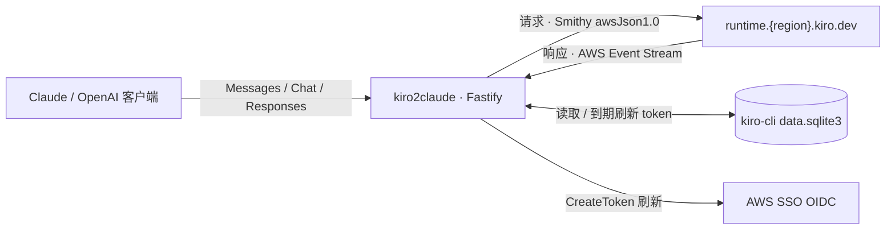

# kiro2claude

> 用你自己的 kiro-cli 套餐,给任何 Claude / OpenAI 客户端供能。

**双协议兼容网关**:把 kiro-cli(Kiro 后端)包装成 Anthropic Messages API + OpenAI Chat Completions / Responses API。改个 base URL,Claude Code、Cursor、OpenAI SDK、Codex CLI 直接接入,账单走你的 kiro-cli,后端对客户端透明。

[](./LICENSE)

[](https://github.com/yupanzi/kiro2claude/pkgs/container/kiro2claude)

> **免责声明**:非官方项目,与 AWS、Amazon、Anthropic、OpenAI、Kiro 均无关联、未获授权;上述名称为各自所有者的商标,此处仅用于说明 API 协议兼容。仅供学习研究、非商业用途;接入第三方代理**可能违反上游服务条款并导致账号封停**。软件按 [MIT](./LICENSE)「原样(AS IS)」提供、不含任何担保,**风险与法律责任自负**。

## 亮点

- **双协议、三端点**——`/claude/v1`(Messages)+ `/openai/v1`(Chat Completions & Responses)。一套凭据同时喂 Anthropic 和 OpenAI 生态,不用起两个服务。
- **模型全,reasoning 原生**——Claude 全系 + GPT-5.6(Sol / Terra / Luna)。Extended Thinking、`reasoning_effort` 直接映射 Kiro 原生 reasoning,不靠 prompt 硬凑。
- **真客户端跑通,不只是"兼容 SDK"**——Claude Code、Codex CLI 的对话 + 工具调用端到端实测过(harness 在 [`tools/`](./tools/))。
- **替你抠上游的坑**——工具调用文本救援、空流自动重试、身份覆写、`/api/*` 去插件字段镜像:把 Kiro 的偶发毛病在网关层吸收掉,客户端无感。
- **插件化,全 MIT**——计量、credit 反演都是插件,经 [`@kiro2claude/plugin-api`](./packages/plugin-api/) 契约接入;写自己的插件不用碰 core。
- **零配置文件**——纯环境变量,复用 kiro-cli 的 SQLite 凭据,token 到期自动刷新。

此外 Vision、流式 SSE、WebSearch(`web_search_20250305` → Kiro MCP)、`count_tokens` 开箱即用。

## 架构



- **认证**——kiro-cli device code flow(Builder ID / IAM Identity Center),见 [kiro.dev 文档](https://kiro.dev/docs/cli/authentication/)
- **上游**——`POST runtime.<region>.kiro.dev/generateAssistantResponse`,请求 Smithy awsJson1.0、响应 AWS Event Stream;WebSearch 走 `/mcp`
- **存储**——复用 kiro-cli 的 SQLite 凭据,token 到期就地刷新

## 快速开始

```bash
# 1. 装好 kiro-cli 并登录(凭据写入本地 SQLite)
kiro-cli login --use-device-flow --identity-provider https://your-idc.awsapps.com/start --region us-east-1
# 或 Builder ID:kiro-cli login --use-device-flow --license free

# 2. 装依赖、起服务
pnpm install
KIRO2CLAUDE_API_KEY=sk-local-test \
KIRO2CLAUDE_SQLITE_DB_PATH="$HOME/Library/Application Support/kiro-cli/data.sqlite3" \
pnpm dev
```

> Linux 的 SQLite 路径是 `~/.local/share/kiro-cli/data.sqlite3`(macOS 路径含空格,必须带引号)。

服务默认监听 `127.0.0.1:8080`。把客户端 base URL 指向 `http://127.0.0.1:8080/claude/v1`、key 设为 `sk-local-test`:

```bash
curl -s http://127.0.0.1:8080/claude/v1/messages \
  -H 'x-api-key: sk-local-test' -H 'content-type: application/json' \
  -d '{"model":"claude-opus-4-8","max_tokens":64,"messages":[{"role":"user","content":"ping"}]}' \
  | jq '.content[0].text'
```

## HTTP 路由

所有接口用 `KIRO2CLAUDE_API_KEY` 鉴权(`/health` 除外)。

| 路径 | 方法 | 说明 |
|---|---|---|
| `/health` | GET | liveness 探针(免鉴权) |
| `/claude/v1/models` | GET | Claude 模型列表 |
| `/claude/v1/messages` | POST | Claude 消息接口(流式 / Vision / 工具调用 / thinking) |
| `/claude/v1/messages/count_tokens` | POST | Token 计数 |
| `/openai/v1/models` | GET | OpenAI 模型列表 |
| `/openai/v1/chat/completions` | POST | OpenAI Chat Completions(流式 / tool_calls / reasoning) |
| `/openai/v1/responses` | POST | OpenAI Responses API——**Codex CLI 走这条** |
| `/api/{claude,openai}/v1/*` | 同上 | 去泄漏镜像:`usage` 剥掉插件扩展字段,只留标准响应 |
| `/kiro/usage` | GET | 透传 Kiro `getUsageLimits` |

想要计量字段用 `/claude/v1`;想要纯标准响应用 `/api/claude/v1`(计量后台照跑)。OpenAI 客户端 base URL 指到 `.../openai/v1`、`Authorization: Bearer <key>`。模型 ID 见 [`models-catalog.ts`](./packages/core/src/claude/models-catalog.ts),Claude 每个模型都有 `-thinking` 变体。

## Docker

单一镜像 [`ghcr.io/yupanzi/kiro2claude`](https://github.com/yupanzi/kiro2claude/pkgs/container/kiro2claude)(公开、免鉴权 pull),内置 core + 两个默认启用的插件。

```bash
docker pull ghcr.io/yupanzi/kiro2claude:latest
cp .env.example .env   # 填 KIRO2CLAUDE_API_KEY 等

docker run -d --name kiro2claude --env-file .env \
  -e KIRO2CLAUDE_HOST=0.0.0.0 \
  -e KIRO2CLAUDE_LOGIN_START_URL=https://d-xxx.awsapps.com/start \
  -e KIRO2CLAUDE_LOGIN_REGION=us-east-1 \
  -p 8080:8080 \
  -v kiro-home:/home/kiro/.local/share/kiro-cli \
  ghcr.io/yupanzi/kiro2claude:latest

docker logs -f kiro2claude   # 跟随日志,浏览器打开 device flow URL 完成认证
```

设了 `KIRO2CLAUDE_LOGIN_START_URL` 即容器免交互登录:首次启动在日志打出 device flow URL。本地构建用 `./scripts/docker-build.sh -t kiro2claude`。

## 插件

实现 [`@kiro2claude/plugin-api`](./packages/plugin-api/) 契约即可扩展网关(加路由、往 `usage` 注入 wire 字段),不用改 core——loader 自动发现 `node_modules` 里带 `kiro2claude-plugin` keyword 的包,按 `dependsOn` 拓扑加载。指南见 [`docs/PLUGIN-DEVELOPMENT.md`](./docs/PLUGIN-DEVELOPMENT.md),示范见 [`echo-plugin`](./packages/examples/echo-plugin/)。

镜像内置两个插件(默认开):

- [`plugin-metering`](./packages/plugin-metering/)——计量本次 credit 消耗,注入 `usage.kiro_metering`(`KIRO2CLAUDE_METERING_DISABLE=true` 可关)
- [`plugin-derived`](./packages/plugin-derived/)——把 Kiro credit 反演成 Anthropic 风格 token/cache 字段,注入 `usage.kiro_derived`

## 开发

```bash
pnpm test        # vitest 全套
pnpm typecheck   # tsc --noEmit
pnpm check       # biome format + lint(不写盘)
pnpm run ci      # biome ci + typecheck + test
```

pnpm workspace,Node ≥ 22 / TypeScript / ES Modules。husky pre-commit 强制 `biome check + typecheck + vitest`,`pnpm install` 后自动生效;提交遵循 [Conventional Commits](https://www.conventionalcommits.org/),细节见 [CONTRIBUTING.md](./CONTRIBUTING.md)。

## 文档

| 主题 | 入口 |
|---|---|
| 架构分层 / 代码风格 / 踩坑地图 | [CLAUDE.md](./CLAUDE.md) |
| 插件开发指南 | [`docs/PLUGIN-DEVELOPMENT.md`](./docs/PLUGIN-DEVELOPMENT.md) |
| 插件契约类型 | [`packages/plugin-api/`](./packages/plugin-api/) |
| 贡献 / 提交规范 | [CONTRIBUTING.md](./CONTRIBUTING.md) |
| 安全披露 | [SECURITY.md](./SECURITY.md) |

## 许可证

[MIT](./LICENSE),Copyright (c) 2026 yupanzi。
