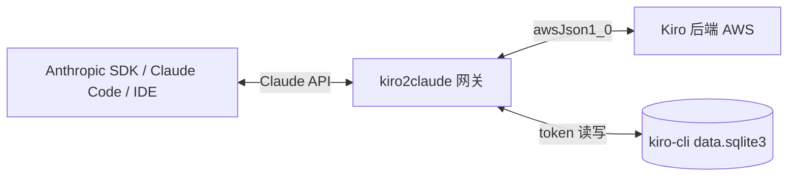

# kiro2claude

把 **kiro-cli**(AWS CodeWhisperer / Kiro 后端,Builder ID 或 IAM Identity Center 登录)包装成一个 **Claude API 兼容的 HTTP 网关**。下游任何使用 Anthropic Messages API 协议的客户端都能直接接上来跑 Claude 模型,账单走你的 kiro-cli 套餐。

[](./LICENSE)


[](https://hub.docker.com/r/kiro2claude/core)

**目录**: [架构](#架构) · [快速开始](#快速开始) · [主要特性](#主要特性) · [HTTP 路由](#http-路由) · [Docker](#docker) · [插件](#插件) · [深入文档](#深入文档)

## 架构



- **运行时**:Node.js ≥ 22、TypeScript 5.9、ES Modules(NodeNext)、Fastify 5、pnpm workspace
- **认证**:仅支持 kiro-cli 的 **device code authentication**(Builder ID / IAM Identity Center),详见 <https://kiro.dev/docs/cli/authentication/>
- **配置**:纯环境变量(`KIRO2CLAUDE_*` 前缀),无 JSON 配置文件、无命令行参数
- **存储**:复用 kiro-cli 自己的 SQLite 凭据库,token 到期就地刷新写回

## 主要特性

| 维度 | 内容 |
|---|---|
| **协议兼容** | `/claude/v1/{models,messages,messages/count_tokens}`,支持非流式 & 流式 SSE、Vision、tool_use、Extended Thinking |
| **原生 reasoning** | Anthropic Extended Thinking 1:1 映射到 Kiro 原生 `reasoning.effort`(仅 `claude-opus-4.7/4.8`,其余模型回落 prompt 注入) |
| **WebSearch / MCP** | Claude `web_search_20250305` 工具透明转 Kiro MCP 调用 |
| **Token 计数** | `/messages/count_tokens` 本地估算 + 可选远程 API 回退 |
| **首次启动自动登录** | 容器场景设 `KIRO2CLAUDE_LOGIN_START_URL`,首次启动即在日志输出 device flow URL,**无需 `docker exec`** |
| **插件系统** | 通过 [`@kiro2claude/plugin-api`](./packages/plugin-api/) 契约扩展路由 / wire 字段;loader 自动发现带 `kiro2claude-plugin` keyword 的包 |
| **身份覆写** | 默认在 system prompt 末尾追加一行 directive,让模型自报为 Claude / Anthropic、挡住其自报 Q/Kiro(可关:`KIRO2CLAUDE_IDENTITY_OVERRIDE=false`,换更高 prompt cache 命中率) |

## 快速开始

面向本地开发。

```bash
# 1. 装好 kiro-cli 并跑 device flow 登录(凭据写入本地 SQLite)
kiro-cli login --use-device-flow --identity-provider https://your-idc.awsapps.com/start --region us-east-1
# 或 Builder ID:
kiro-cli login --use-device-flow --license free

# 2. 安装依赖(husky pre-commit 钩子随之生效)
pnpm install

# 3. 启动开发模式
# macOS(kiro-cli SQLite 路径含空格,必须引号)
KIRO2CLAUDE_API_KEY=sk-local-test \
KIRO2CLAUDE_SQLITE_DB_PATH="$HOME/Library/Application Support/kiro-cli/data.sqlite3" \
pnpm dev

# Linux
KIRO2CLAUDE_API_KEY=sk-local-test \
KIRO2CLAUDE_SQLITE_DB_PATH=~/.local/share/kiro-cli/data.sqlite3 \
pnpm dev
```

服务默认监听 `127.0.0.1:8080`。把任意 Claude API 客户端的 base URL 指向 `http://127.0.0.1:8080/claude/v1`、API key 设为 `sk-local-test` 即可。

### 验证

```bash
# 列出模型
curl -s http://127.0.0.1:8080/claude/v1/models \
  -H 'x-api-key: sk-local-test' | jq '.data[].id'

# 非流式 Messages
curl -s http://127.0.0.1:8080/claude/v1/messages \
  -H 'x-api-key: sk-local-test' -H 'content-type: application/json' \
  -d '{"model":"claude-opus-4-7","max_tokens":64,"messages":[{"role":"user","content":"ping"}]}' \
  | jq '.content[0].text'
```

## HTTP 路由

| 路径 | 方法 | 鉴权 | 说明 |
|---|---|---|---|
| `/health` | GET | 无 | liveness 探针 |
| `/claude/v1/models` | GET | `KIRO2CLAUDE_API_KEY` | Claude 兼容模型列表 |
| `/claude/v1/messages` | POST | `KIRO2CLAUDE_API_KEY` | Claude 兼容消息接口(支持流式) |
| `/claude/v1/messages/count_tokens` | POST | `KIRO2CLAUDE_API_KEY` | Token 计数 |
| `/kiro/usage` | GET | `KIRO2CLAUDE_API_KEY` | 透传 Kiro `getUsageLimits` |

Plugin 注册的额外路由由各 plugin 自行声明,以 plugin 文档为准。支持的模型 ID 见 [`models-catalog.ts`](./packages/core/src/claude/models-catalog.ts):opus 4.5/4.6/4.7/4.8、sonnet 5/4.6/4.5、haiku 4.5,每个都有对应的 `-thinking` 变体。

## Docker

本节讲 **core 镜像**(`docker/Dockerfile`)。镜像用"三方版本校验"锁定 kiro-cli 二进制 ↔ fixture ↔ Dockerfile `ARG`,确保 runtime 的 client profile 与上游 kiro-cli 同版本、不偷偷漂移。

```bash
docker build -t kiro2claude .
cp .env.example .env   # 填入 KIRO2CLAUDE_API_KEY 等
docker run -d --name kiro2claude \
  --env-file .env \
  -e KIRO2CLAUDE_HOST=0.0.0.0 \
  -e KIRO2CLAUDE_LOGIN_START_URL=https://d-xxx.awsapps.com/start \
  -e KIRO2CLAUDE_LOGIN_REGION=us-east-1 \
  -p 8080:8080 \
  -v kiro-home:/home/kiro/.local/share/kiro-cli \
  kiro2claude
docker logs -f kiro2claude   # 跟随日志找到 device flow URL,浏览器完成认证
```

首次启动 bootstrap login、版本漂移恢复、auto-capture 的完整说明见 [CLAUDE.md](./CLAUDE.md)。

## 插件

不改动 core 即可扩展网关:实现 [`@kiro2claude/plugin-api`](./packages/plugin-api/) 契约、打成自己的包,loader 自动发现并按 `dependsOn` 拓扑排序加载。插件可注册新 HTTP 路由,或在 `usage` finish 时注入 wire 字段。

- 开发指南:[`docs/PLUGIN-DEVELOPMENT.md`](./docs/PLUGIN-DEVELOPMENT.md)
- 契约类型:[`packages/plugin-api/`](./packages/plugin-api/)
- 最小示范:[`packages/examples/echo-plugin/`](./packages/examples/echo-plugin/)

## 配套工具

- [`scripts/capture-kiro-cli.sh`](./scripts/capture-kiro-cli.sh) — 抓 kiro-cli 真实 wire 行为,生成 `fixtures/kiro-cli-profile.json`
- [`scripts/docker-build.sh`](./scripts/docker-build.sh) / [`scripts/docker-run.sh`](./scripts/docker-run.sh) — Docker 构建 / 运行 wrapper,自动从 fixture 读 `KIRO2CLAUDE_CLI_VERSION`

## 深入文档

| 主题 | 入口 |
|---|---|
| 仓库约定 / 架构分层 / 代码风格 / 关键陷阱 | [CLAUDE.md](./CLAUDE.md) |
| 插件开发指南 | [`docs/PLUGIN-DEVELOPMENT.md`](./docs/PLUGIN-DEVELOPMENT.md) |
| 插件契约类型 | [`packages/plugin-api/`](./packages/plugin-api/) |
| 示范插件 | [`packages/examples/echo-plugin/`](./packages/examples/echo-plugin/) |
| 贡献流程 / 提交规范 | [CONTRIBUTING.md](./CONTRIBUTING.md) |
| 安全披露 | [SECURITY.md](./SECURITY.md) |

## 测试 & CI

```bash
pnpm test         # vitest 全套(parser / token-manager / converter / stream 等)
pnpm typecheck    # tsc --noEmit
pnpm check        # biome format + lint + import 整理(不写盘)
pnpm run ci       # biome ci + typecheck + test(CI 入口)
```

husky 在每次 `git commit` 前强制 `biome check + tsc --noEmit + vitest run` 三道检查,clone 后跑过 `pnpm install` 即自动生效。提交信息遵循 [Conventional Commits](https://www.conventionalcommits.org/),由 commit-msg 钩子校验;Markdown 文档由 markdownlint 约束。细节见 [CONTRIBUTING.md](./CONTRIBUTING.md)。

## 许可证

以 [MIT](./LICENSE) 许可证发布,Copyright (c) 2026 yupanzi。可自由用于商业与非商业用途,保留版权与许可声明即可。
