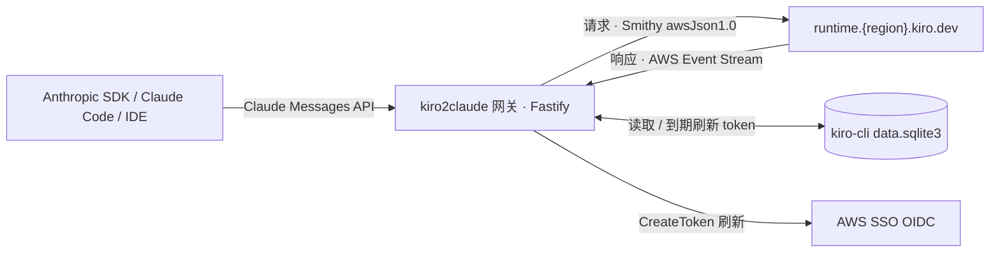

# kiro2claude

把 **kiro-cli** 包装成 **Claude API 兼容的 HTTP 网关**——任何 Anthropic Messages API 客户端(SDK / Claude Code / IDE)直接接入,账单走你自己的 kiro-cli 套餐。

[](./LICENSE)


[](https://github.com/yupanzi/kiro2claude/pkgs/container/kiro2claude)

> **免责声明:** 非官方实验项目,与 AWS / Amazon / Anthropic 无关联、未授权,相关名称均为各自商标(仅作 API 协议兼容)。仅供学习研究、非商业用途;接入第三方代理**可能违反上游服务条款并致账号封停**。依 [MIT](./LICENSE) 以"现状(AS IS)"提供、不含担保,**风险与法律责任自负**。

## 架构



- **认证**:仅支持 kiro-cli 的 device code flow(Builder ID / IAM Identity Center),见 <https://kiro.dev/docs/cli/authentication/>
- **上游**:`POST runtime.<region>.kiro.dev/generateAssistantResponse`,请求 Smithy awsJson1.0、响应 AWS Event Stream;WebSearch 走 `/mcp`
- **配置**:纯环境变量(`KIRO2CLAUDE_*`),无配置文件、无命令行参数
- **存储**:复用 kiro-cli 的 SQLite 凭据库,token 到期就地刷新

## 主要特性

| 维度 | 内容 |
|---|---|
| **协议兼容** | 非流式 & 流式 SSE、Vision、tool_use、Extended Thinking |
| **原生 reasoning** | Extended Thinking 1:1 映射 Kiro 原生 `reasoning.effort`(仅 opus 4.7/4.8,其余回落 prompt 注入) |
| **WebSearch / MCP** | Claude `web_search_20250305` 工具透明转 Kiro MCP 调用 |
| **Token 计数** | `count_tokens` 本地估算 + 可选远程回退 |
| **容器免交互登录** | 设 `KIRO2CLAUDE_LOGIN_START_URL`,首次启动即在日志打出 device flow URL |
| **插件系统** | 通过 [`@kiro2claude/plugin-api`](./packages/plugin-api/) 契约扩展路由 / wire 字段 |
| **身份覆写** | 默认注入 system directive,挡住模型自报 Q/Kiro(`KIRO2CLAUDE_IDENTITY_OVERRIDE=false` 可关) |
| **工具调用文本救援** | 上游偶发把工具调用当纯文本下发,默认就地解析回真 tool_use 并清理历史泄漏(`KIRO2CLAUDE_TOOL_CALL_TEXT_RESCUE=false` 可关) |

## 快速开始

```bash
# 1. 装好 kiro-cli 并跑 device flow 登录(凭据写入本地 SQLite)
kiro-cli login --use-device-flow --identity-provider https://your-idc.awsapps.com/start --region us-east-1
# 或 Builder ID:
kiro-cli login --use-device-flow --license free

# 2. 安装依赖
pnpm install

# 3. 启动开发模式
# macOS(kiro-cli SQLite 路径含空格,必须引号)
KIRO2CLAUDE_API_KEY=sk-local-test \
KIRO2CLAUDE_SQLITE_DB_PATH="$HOME/Library/Application Support/kiro-cli/data.sqlite3" \
pnpm dev

# Linux
KIRO2CLAUDE_API_KEY=sk-local-test \
KIRO2CLAUDE_SQLITE_DB_PATH=~/.local/share/kiro-cli/data.sqlite3 \
pnpm dev
```

服务默认监听 `127.0.0.1:8080`。把 Claude API 客户端的 base URL 指向 `http://127.0.0.1:8080/claude/v1`、API key 设为 `sk-local-test` 即可。

```bash
# 列出模型
curl -s http://127.0.0.1:8080/claude/v1/models \
  -H 'x-api-key: sk-local-test' | jq '.data[].id'

# 非流式 Messages
curl -s http://127.0.0.1:8080/claude/v1/messages \
  -H 'x-api-key: sk-local-test' -H 'content-type: application/json' \
  -d '{"model":"claude-opus-4-8","max_tokens":64,"messages":[{"role":"user","content":"ping"}]}' \
  | jq '.content[0].text'
```

## HTTP 路由

| 路径 | 方法 | 鉴权 | 说明 |
|---|---|---|---|
| `/health` | GET | 无 | liveness 探针 |
| `/claude/v1/models` | GET | `KIRO2CLAUDE_API_KEY` | Claude 兼容模型列表 |
| `/claude/v1/messages` | POST | `KIRO2CLAUDE_API_KEY` | Claude 兼容消息接口(支持流式) |
| `/claude/v1/messages/count_tokens` | POST | `KIRO2CLAUDE_API_KEY` | Token 计数 |
| `/api/v1/*` | 同左 | `KIRO2CLAUDE_API_KEY` | `/claude/v1/*` 的**去泄漏镜像**:`usage` 剥掉 plugin 扩展字段(如 `kiro_metering`),只留标准 Anthropic 字段 |
| `/kiro/usage` | GET | `KIRO2CLAUDE_API_KEY` | 透传 Kiro `getUsageLimits` |

想拿计量字段用 `/claude/v1`,想要纯标准响应用 `/api/v1`(计量仍后台照常累计)。模型 ID 见 [`models-catalog.ts`](./packages/core/src/claude/models-catalog.ts),每个模型都有 `-thinking` 变体。

## Docker

发布形态是单一镜像 [`ghcr.io/yupanzi/kiro2claude`](https://github.com/yupanzi/kiro2claude/pkgs/container/kiro2claude)(公开、免鉴权 pull),内置 core 网关 + 两个默认启用的 first-party 插件。

```bash
# 直接拉已发布镜像(推荐)
docker pull ghcr.io/yupanzi/kiro2claude:latest

# 或本地构建(wrapper 自动从 fixture 读版本号)
./scripts/docker-build.sh -t kiro2claude

cp .env.example .env   # 填入 KIRO2CLAUDE_API_KEY 等
docker run -d --name kiro2claude \
  --env-file .env \
  -e KIRO2CLAUDE_HOST=0.0.0.0 \
  -e KIRO2CLAUDE_LOGIN_START_URL=https://d-xxx.awsapps.com/start \
  -e KIRO2CLAUDE_LOGIN_REGION=us-east-1 \
  -p 8080:8080 \
  -v kiro-home:/home/kiro/.local/share/kiro-cli \
  ghcr.io/yupanzi/kiro2claude:latest
docker logs -f kiro2claude   # 跟随日志找到 device flow URL,浏览器完成认证
```

首次启动 bootstrap login、版本漂移恢复、auto-capture 的完整说明见 [CLAUDE.md](./CLAUDE.md)。

## 插件

实现 [`@kiro2claude/plugin-api`](./packages/plugin-api/) 契约即可扩展网关(新路由、`usage` wire 字段),无需改 core:loader 自动发现 `node_modules` 里带 `kiro2claude-plugin` keyword 的包并按 `dependsOn` 拓扑加载。开发指南见 [`docs/PLUGIN-DEVELOPMENT.md`](./docs/PLUGIN-DEVELOPMENT.md),示范见 [`packages/examples/echo-plugin/`](./packages/examples/echo-plugin/)。

镜像内置两个 first-party 插件(随镜像携带,默认启用):

- [`plugin-metering`](./packages/plugin-metering/) —— 计量本次 credit 消耗,注入 `usage.kiro_metering`(`KIRO2CLAUDE_METERING_DISABLE=true` 可关)
- [`plugin-derived`](./packages/plugin-derived/) —— 把 Kiro credit 反演成 Anthropic 风格 token/cache 字段,注入 `usage.kiro_derived`

## 开发

```bash
pnpm test         # vitest 全套(parser / token-manager / converter / stream 等)
pnpm typecheck    # tsc --noEmit
pnpm check        # biome format + lint + import 整理(不写盘)
pnpm run ci       # biome ci + typecheck + test(CI 入口)
```

husky pre-commit 强制 `biome check + typecheck + vitest` 三道检查,`pnpm install` 后自动生效;提交信息遵循 [Conventional Commits](https://www.conventionalcommits.org/),细节见 [CONTRIBUTING.md](./CONTRIBUTING.md)。

配套脚本:[`scripts/capture-kiro-cli.sh`](./scripts/capture-kiro-cli.sh) 抓 kiro-cli 真实 wire 行为生成 fixture;[`scripts/docker-build.sh`](./scripts/docker-build.sh) / [`scripts/docker-run.sh`](./scripts/docker-run.sh) 自动从 fixture 读版本号。

## 深入文档

| 主题 | 入口 |
|---|---|
| 仓库约定 / 架构分层 / 代码风格 / 关键陷阱 | [CLAUDE.md](./CLAUDE.md) |
| 插件开发指南 | [`docs/PLUGIN-DEVELOPMENT.md`](./docs/PLUGIN-DEVELOPMENT.md) |
| 插件契约类型 | [`packages/plugin-api/`](./packages/plugin-api/) |
| 示范插件 | [`packages/examples/echo-plugin/`](./packages/examples/echo-plugin/) |
| 贡献流程 / 提交规范 | [CONTRIBUTING.md](./CONTRIBUTING.md) |
| 安全披露 | [SECURITY.md](./SECURITY.md) |

## 许可证

[MIT](./LICENSE),Copyright (c) 2026 yupanzi。
